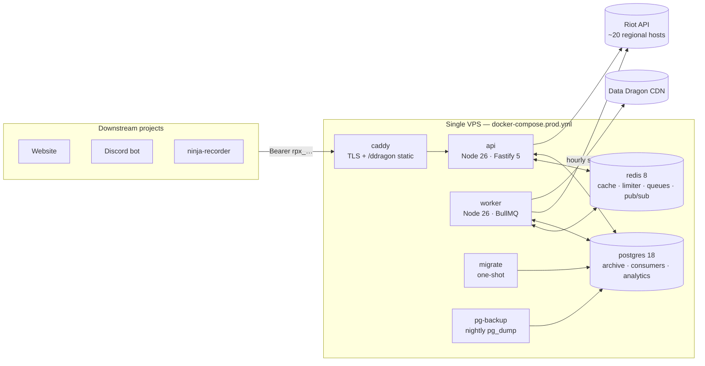

# 01 — Current state (v1)

An honest audit of `NinjaGoldfinch/riot-proxy` at `2a40c11`, so the redesign is grounded in what exists rather than what the spec said would exist.

## What v1 is

| Metric | Value |
|---|---|
| Source | ~16,000 lines of TypeScript across `src/` |
| Runtime deps | 15 (`fastify`, `bullmq`, `drizzle-orm`, `ioredis`, `postgres`, `undici`, `pino`, `prom-client`, …) |
| Containers in prod | 7 (`api`, `worker`, `migrate`, `redis`, `postgres`, `pg-backup`, `caddy`) |
| Persistent volumes | 4 (`redis-data`, `pg-data`, `ddragon`, backups) |
| Migrations | 10 SQL files (Drizzle) |
| Riot endpoints wrapped | 9 endpoint groups (`account`, `summoner`, `league`, `match`, `spectator`, `mastery`, `rotations`, `status`, ladder) |
| Public surface | `/v1/riot/*` passthrough, `/v1/lol/*`, `/v1/players/*` composites, `/v1/admin/*`, `/v1/ws`, `/docs`, `/dev`, `/dashboard` |

## What v1 gets right — and v2 must keep

These are the parts that took real thought. They are **design**, not **stack**, and they port unchanged:

1. **Header-driven buckets.** Limits are never hardcoded; `X-App-Rate-Limit` / `X-Method-Rate-Limit` reconfigure buckets and the `-Count` headers absorb usage from other tooling on the same key.
2. **Atomic multi-window acquisition with rollback.** Take one token from every applicable window or none.
3. **Two priorities.** `interactive` outranks `bulk`; bulk stops at `BULK_USAGE_CEILING` (80%) so user latency stays flat during backfills.
4. **429 taxonomy.** Typed 429 → freeze scope until `Retry-After`, log as accounting error. Untyped 429 → jittered backoff, leave buckets alone.
5. **`key_scope` rule.** `sha256(RIOT_API_KEY)[..8]` in every cache key and every row holding an encrypted ID, so key rotation strands stale IDs instead of poisoning lookups.
6. **Soft/hard TTL + stale-while-revalidate**, and serving stale on upstream 5xx.
7. **Negative cache** with a distinct prefix so "not in game" ≠ "unknown".
8. **`X-Cache-Age` tracks content, not fetch** — a byte-identical re-read keeps its original timestamp.
9. **Immutable match archive** as the highest-leverage cache; first lookup queues the whole history; archive queue ordered globally by recency.
10. **Crawl in three phases** (enumerate → collect → archive) so a ten-participant match is fetched once.
11. **OpenAPI generated from the validation schemas**, so the contract cannot drift.
12. **`AUTH_DISABLED` refuses to boot in production.** Small, correct, worth copying.

## What v1 costs

### Infrastructure carries coordination the workload does not need

Every one of these exists to let *N* api replicas and a separate worker agree on shared state:

| Component | What it coordinates | Do we have >1 process that needs it? |
|---|---|---|
| Redis Lua limiter | Token buckets across replicas | No — one Riot key, one limit, one process suffices |
| Redis cache | Shared cache across replicas | No |
| Redis single-flight lock (`SF_LOCK_MS`) | Coalescing across replicas | No — in-process coalescing is trivial and lock-free |
| BullMQ | Producer (api) ↔ consumer (worker) | Only because api and worker are split |
| Redis pub/sub | Worker events → api WebSockets | Same |
| Postgres | Concurrent writers from api + worker | Same |

The api/worker split was inherited from the spec's Phase 6, not from a measured need. Removing it collapses the whole left column.

### Operational surface area

- Two runtime pins (`node >=26 <27` with `engine-strict`, plus specific Redis and Postgres majors) that can each break a deploy independently.
- `npm ci` + multi-stage build + a `migrate` container that must complete before `api` is healthy: cold start is measured in tens of seconds.
- Redis persistence has to be configured correctly (`appendonly yes`) or limiter state is lost on restart and the first minute after a deploy is a 429 storm. This is documented in the README as a gotcha — which means it is a design smell.
- Backups mean `pg_dump` cron + a volume + retention logic. A SQLite archive is one file you `cp` (or better, `sqlite3 .backup`).
- Anyone deploying this needs to understand Docker Compose, two database images and an ORM's migrator before the first request succeeds.

### Resource footprint (typical idle figures for these images — verify with `docker stats` on your box before quoting them)

| Service | RSS (typical) |
|---|---|
| `api` (Node) | ~110 MB |
| `worker` (Node) | ~95 MB |
| `redis` | ~15 MB |
| `postgres` | ~60 MB (+ shared buffers) |
| `caddy` | ~25 MB |
| **Total** | **~300 MB idle**, before any match archive is loaded |

Not catastrophic — but it rules out the smallest instances and makes "run it on the same box as the bot" a squeeze.

### Things that are harder than they should be

- **Local dev needs `docker compose up` before `npm run dev`.** A proxy for hobby projects should start with `./riot-proxy` and a `.env`.
- **Tests need live Redis and Postgres** (`vitest.acceptance.config.ts`), so CI is slower and flakier than the unit-level logic deserves.
- **The limiter is 475 lines of TS orchestrating Lua strings** (`limiter.ts` + `limiter-scripts.ts`). The same algorithm in one process is a `Mutex<HashMap<Scope, Bucket>>` and ~150 lines.
- **The BullMQ priority footgun** (unprioritised jobs outrank prioritised ones) is documented in the README because it bit once. An in-process priority heap has no such rule.

## Verdict

v1's *design* is finished and good. v1's *stack* was chosen for a multi-replica service that a single-key proxy can never become. v2 is a re-platforming, not a rethink: same contract, same algorithms, ~1/5 the moving parts.
