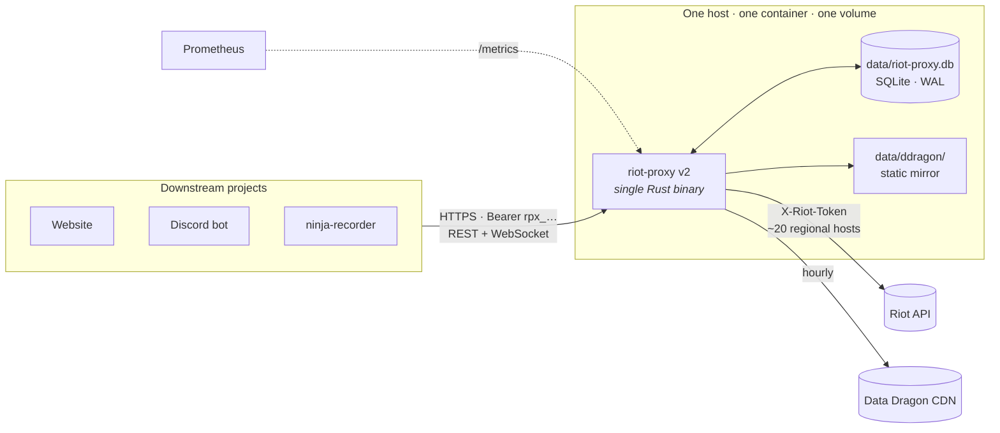
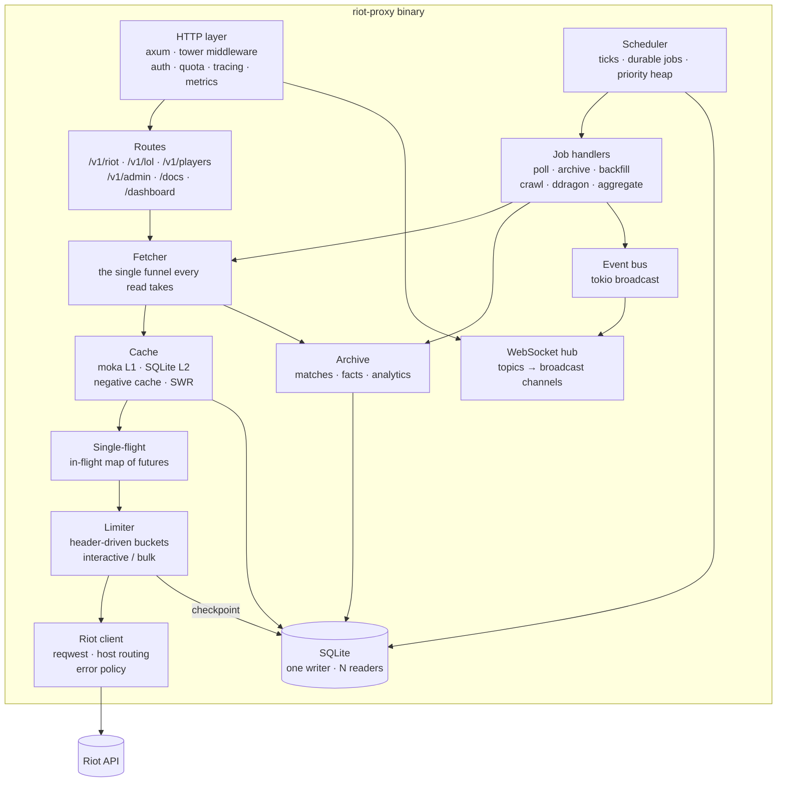
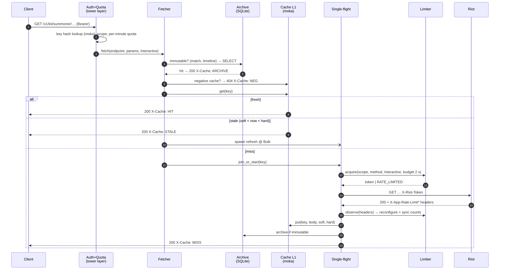
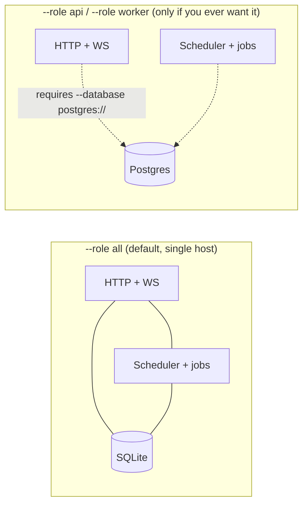
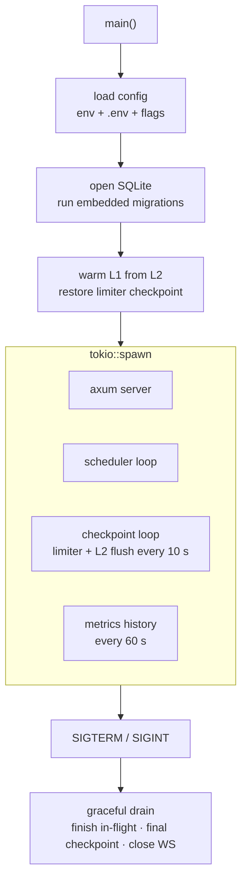

# 03 — Architecture

## System context



Optional pieces, each off by default: Caddy in front (if you already run one), Postgres instead of SQLite (`--features postgres`), external Prometheus/Grafana.

## Why one process is not a compromise

A Riot production key gives *one* application-level rate limit shared by every request made with it. Two proxy replicas do not double your budget; they split it and then need Redis to agree on the split. The proxy's throughput ceiling is Riot's, not the host's. A single tokio runtime on one core can service far more requests per second than a Riot key allows, so scale-out buys nothing.

What you *do* want from multiple processes — availability during a deploy — v2 gets from a sub-100 ms restart, a persisted limiter and a persisted cache: a redeploy is a blip shorter than one Riot round-trip.

## Component diagram



Every box is a Rust module (`src/<name>/`), every arrow is a plain function call or channel — no network hop inside the binary.

## Request lifecycle (read path)

Identical in *policy* to v1 `src/fetcher.ts`; different in *mechanism* — every step is a memory access, not a Redis round-trip.



`X-Cache` values, headers (`X-Cache-Age`, `X-RateLimit-*`, `X-Request-Id`) and error codes (`QUOTA_EXCEEDED` vs `RATE_LIMITED`) are carried over verbatim from v1 so downstream projects need no changes.

## Process model

One binary, one flag.



`--role all` is the design target and the only mode with SQLite. The split mode exists so the door to Postgres + separate worker stays open without a rewrite — but it is a **feature flag**, not the default, and v2.0 can ship without it.

Inside the process:



## Module layout

```
src/
├── main.rs              CLI (clap): serve, key create, migrate, reset, spec
├── config.rs            typed config; refuses AUTH_DISABLED in production
├── app.rs               builds the axum Router + state
├── http/
│   ├── auth.rs          Bearer → consumer (moka-cached sha256 lookup), scopes, IP allowlist
│   ├── quota.rs         per-consumer sliding window
│   ├── error.rs         ApiError → JSON body + status (same codes as v1)
│   └── headers.rs       X-Cache, X-Cache-Age, X-RateLimit-*, X-Request-Id
├── routes/
│   ├── riot.rs          /v1/riot/* passthrough
│   ├── lol.rs           /v1/lol/*
│   ├── players.rs       /v1/players/* composites (fan-out with join_all)
│   ├── admin.rs         /v1/admin/*
│   ├── health.rs        /healthz /readyz /metrics
│   ├── docs.rs          /openapi.json via utoipa, /docs via utoipa-scalar
│   └── ui.rs            /dev /dashboard — static HTML embedded with include_str!
├── ws/
│   ├── hub.rs           topic → broadcast::Sender; subscribe/unsubscribe protocol
│   └── protocol.rs      frames, same shape as v1 §11
├── fetcher.rs           the funnel (see sequence diagram)
├── cache/
│   ├── l1.rs            moka wrapper: soft/hard TTL, negative entries
│   ├── l2.rs            SQLite cache table, write-behind, boot warm
│   └── keys.rs          key_scope + canonical key
├── singleflight.rs      DashMap<Key, Shared<BoxFuture>>
├── riot/
│   ├── client.rs        reqwest with pool, UA, X-Riot-Token, error policy
│   ├── routing.rs       platform ↔ region, sea→asia for account-v1
│   ├── endpoints.rs     the 9 endpoint groups: path, method-scope, TTLs
│   └── limiter/
│       ├── bucket.rs    window state
│       ├── mod.rs       acquire / observe / freeze / checkpoint
│       └── priority.rs  interactive vs bulk, ceiling
├── jobs/
│   ├── scheduler.rs     ticks, durable table, claim loop, priority heap
│   ├── poll.rs          live / rank / matches
│   ├── archive.rs       archive:match, backfill:player
│   ├── ladder.rs        crawl → apex/walk → collect → archive
│   ├── ddragon.rs       sync + mirror to disk
│   ├── analytics.rs     facts extraction, aggregate:analytics
│   └── maintenance.rs   L2 sweep, WAL checkpoint, backup
├── archive/
│   ├── matches.rs       zstd blobs, filter_unarchived
│   ├── facts.rs         per-participant rows
│   └── analytics.rs     champion stats, matchups, builds
├── db/
│   ├── mod.rs           writer + reader pool, pragmas
│   └── migrations/      NNNN_*.sql embedded via sqlx::migrate! or refinery
├── events.rs            topics enum, publish()
├── metrics.rs           counters/histograms; same names as v1 for the Grafana board
└── static/champions.rs  champion id ↔ name from ddragon mirror
```

Rough size: 6–8k lines of Rust for feature parity, ~half of v1, mostly because the Redis/Postgres/BullMQ glue and the two `docker-compose` files disappear.

## Cross-cutting decisions

| Decision | Choice | Notes |
|---|---|---|
| Async runtime | `tokio` multi-thread, `worker_threads = min(cores, 4)` | The workload is I/O; 4 is plenty |
| SQLite access | `rusqlite` on a dedicated writer thread via `tokio::task::spawn_blocking` + channel; `r2d2`-style reader pool | Keeps async code free of blocking calls; single writer is a SQLite requirement anyway |
| JSON | `serde_json`; match bodies stored as raw bytes, never re-serialised | Passthrough routes forward Riot's bytes untouched |
| Compression | `zstd` level 3 for archive blobs; `tower-http` `CompressionLayer` for responses | |
| IDs | `ulid` for request ids and job ids | Sortable, no coordination |
| Config | `figment` (env + `.env` + `--flag`) or plain `envy` | Same variable names as v1 where they still apply |
| Errors | one `ApiError` enum, `IntoResponse` | Codes unchanged from v1 |
| Time | `jiff` or `time` | Not `chrono` for new code |

## Go equivalents (if you pick Go)

| Rust | Go |
|---|---|
| `axum` + `tower` | `net/http` + middleware funcs, or `chi` |
| `tokio::sync::broadcast` | one `chan` per subscriber in a hub map, or `nhooyr`/`coder` websocket + fan-out goroutine |
| `moka` | `otter` |
| `rusqlite` writer thread | one `*sql.DB` with `SetMaxOpenConns(1)` for writes, a second for reads |
| `utoipa` | `huma` |
| `metrics-exporter-prometheus` | `client_golang` |
| `tracing` | `log/slog` |
