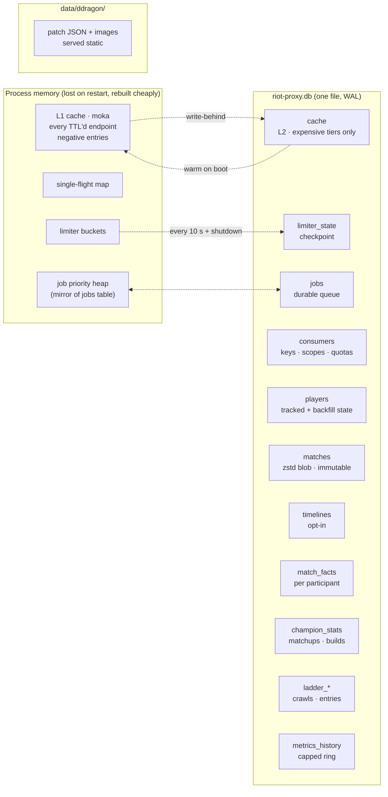

# 04 — Data & cache

## What lives where



## SQLite configuration

Set once on open, from `db/mod.rs`:

```sql
PRAGMA journal_mode = WAL;         -- readers never block the writer
PRAGMA synchronous = NORMAL;       -- durable across process crash; OS crash may lose last txn — acceptable, everything here is re-derivable from Riot
PRAGMA busy_timeout = 5000;
PRAGMA foreign_keys = ON;
PRAGMA cache_size = -65536;        -- 64 MB page cache
PRAGMA mmap_size = 268435456;      -- 256 MB, read path
PRAGMA temp_store = MEMORY;
PRAGMA wal_autocheckpoint = 1000;
```

Connection policy:

- **One writer connection** on a dedicated thread. All `INSERT/UPDATE/DELETE` go through an `mpsc` channel of closures — serialised by construction, so there is never a `SQLITE_BUSY` on write.
- **Reader pool** of `n_cores` connections for the HTTP path. WAL means they see a consistent snapshot without blocking.
- `spawn_blocking` at the boundary; no SQLite call inside an async fn.

A weekly `maintenance` job runs `PRAGMA wal_checkpoint(TRUNCATE)` and `VACUUM INTO 'backups/riot-proxy-YYYY-MM-DD.db'` — that **is** the backup strategy, replacing `pg-backup` + cron. Keep 14, delete older.

## Schema (v2 DDL)

Ported from `src/db/schema.ts` with Postgres-isms removed. `key_scope` semantics are unchanged: any row holding an encrypted ID carries it.

```sql
-- Consumers & auth ─────────────────────────────────────────────────────────
CREATE TABLE consumers (
  id            TEXT PRIMARY KEY,                 -- ulid
  name          TEXT NOT NULL UNIQUE,
  key_sha256    BLOB NOT NULL UNIQUE,             -- plaintext printed once, never stored
  scopes        TEXT NOT NULL,                    -- JSON array: ["read"] | ["read","admin"]
  quota_per_min INTEGER NOT NULL DEFAULT 600,
  created_at    INTEGER NOT NULL,                 -- unix ms everywhere
  revoked_at    INTEGER
);

-- Players ───────────────────────────────────────────────────────────────────
CREATE TABLE players (
  key_scope       TEXT NOT NULL,
  puuid           TEXT NOT NULL,
  platform        TEXT NOT NULL,
  game_name       TEXT, tag_line TEXT,
  tracked         INTEGER NOT NULL DEFAULT 0,
  last_seen_match_id TEXT,                        -- poll:matches cursor (v1 #46)
  backfill_state  TEXT,                           -- JSON: {done, cursor, limit}  (v1 #44)
  last_rank       TEXT,                           -- JSON snapshot for rank.changed diffs
  in_game_id      INTEGER,                        -- for game.started/ended transitions
  updated_at      INTEGER NOT NULL,
  PRIMARY KEY (key_scope, puuid)
);
CREATE INDEX players_tracked ON players(tracked) WHERE tracked = 1;

-- Archive (immutable, survives key rotation — match ids are not encrypted) ──
CREATE TABLE matches (
  match_id     TEXT PRIMARY KEY,                  -- e.g. OC1_123456789
  region       TEXT NOT NULL,
  patch        TEXT NOT NULL,                     -- "14.18"
  queue_id     INTEGER NOT NULL,
  game_end_ms  INTEGER NOT NULL,
  body_zstd    BLOB NOT NULL,                     -- match-v5 payload, zstd
  body_size    INTEGER NOT NULL,                  -- uncompressed, for stats
  archived_at  INTEGER NOT NULL
);
CREATE INDEX matches_patch_queue ON matches(patch, queue_id);
CREATE INDEX matches_end        ON matches(game_end_ms);

CREATE TABLE timelines (                          -- ARCHIVE_TIMELINES=true only
  match_id  TEXT PRIMARY KEY REFERENCES matches(match_id),
  body_zstd BLOB NOT NULL
);

CREATE TABLE match_facts (                        -- one row per participant; pure derivation of matches
  match_id     TEXT NOT NULL REFERENCES matches(match_id) ON DELETE CASCADE,
  key_scope    TEXT NOT NULL,
  puuid        TEXT NOT NULL,
  team_id      INTEGER NOT NULL,
  position     TEXT,
  champion_id  INTEGER NOT NULL,
  win          INTEGER NOT NULL,
  kills INTEGER, deaths INTEGER, assists INTEGER,
  items        TEXT,                              -- JSON [int]
  runes        TEXT,                              -- JSON
  summoners    TEXT,                              -- JSON [int,int]
  facts_version INTEGER NOT NULL,                 -- bump to trigger facts:reextract
  PRIMARY KEY (match_id, puuid)
);
CREATE INDEX facts_player ON match_facts(key_scope, puuid, match_id);
CREATE INDEX facts_champ  ON match_facts(champion_id);

-- Analytics (recomputed; safe to TRUNCATE) ──────────────────────────────────
CREATE TABLE champion_stats (
  patch TEXT, queue_id INTEGER, champion_id INTEGER, position TEXT,
  games INTEGER, wins INTEGER, bans INTEGER,
  PRIMARY KEY (patch, queue_id, champion_id, position)
);
CREATE TABLE champion_matchups (
  patch TEXT, queue_id INTEGER, position TEXT, champion_id INTEGER, vs_champion_id INTEGER,
  games INTEGER, wins INTEGER,
  PRIMARY KEY (patch, queue_id, position, champion_id, vs_champion_id)   -- v1 migration 0009 order
);
CREATE TABLE champion_builds (
  patch TEXT, queue_id INTEGER, champion_id INTEGER, position TEXT,
  build_hash TEXT, items TEXT, games INTEGER, wins INTEGER,
  PRIMARY KEY (patch, queue_id, champion_id, position, build_hash)
);

-- Ladder ────────────────────────────────────────────────────────────────────
CREATE TABLE ladder_crawls (
  id TEXT PRIMARY KEY, platform TEXT, queue TEXT,
  phase TEXT NOT NULL,                            -- enumerate | collect | archive | done
  tier_floor TEXT, started_at INTEGER, finished_at INTEGER,
  stats TEXT                                      -- JSON counters for /dashboard
);
CREATE TABLE ladder_entries (
  crawl_id TEXT REFERENCES ladder_crawls(id) ON DELETE CASCADE,
  key_scope TEXT, puuid TEXT, tier TEXT, division TEXT, lp INTEGER, wins INTEGER, losses INTEGER,
  PRIMARY KEY (crawl_id, puuid)
);
CREATE TABLE crawl_match_ids (                    -- the "collect" set
  crawl_id TEXT REFERENCES ladder_crawls(id) ON DELETE CASCADE,
  match_id TEXT, PRIMARY KEY (crawl_id, match_id)
);

-- Operational ───────────────────────────────────────────────────────────────
CREATE TABLE cache (                              -- L2, expensive tiers only
  key          TEXT PRIMARY KEY,                  -- already includes key_scope
  body         BLOB NOT NULL,
  status       INTEGER NOT NULL,                  -- 200 or 404 (negative)
  content_at   INTEGER NOT NULL,                  -- for X-Cache-Age (content, not fetch)
  soft_expires INTEGER NOT NULL,
  hard_expires INTEGER NOT NULL
);
CREATE INDEX cache_hard ON cache(hard_expires);

CREATE TABLE limiter_state (
  scope       TEXT PRIMARY KEY,                   -- "app:euw1" | "method:euw1:match.byId" | …
  windows     TEXT NOT NULL,                      -- JSON [{limit, seconds, count, reset_at}]
  frozen_until INTEGER,
  updated_at  INTEGER NOT NULL
);

CREATE TABLE jobs (
  id          TEXT PRIMARY KEY,                   -- ulid
  kind        TEXT NOT NULL,                      -- "archive:match" …
  dedupe_key  TEXT,                               -- UNIQUE while pending/running
  priority    INTEGER NOT NULL,                   -- lower runs first; see 06
  payload     TEXT NOT NULL,                      -- JSON
  state       TEXT NOT NULL DEFAULT 'pending',    -- pending | running | done | failed
  attempts    INTEGER NOT NULL DEFAULT 0,
  run_after   INTEGER NOT NULL,                   -- backoff
  claimed_at  INTEGER, finished_at INTEGER, error TEXT
);
CREATE UNIQUE INDEX jobs_dedupe ON jobs(kind, dedupe_key) WHERE state IN ('pending','running');
CREATE INDEX jobs_claim ON jobs(state, run_after, priority) WHERE state = 'pending';

CREATE TABLE metrics_history (                    -- 1440 rows ≈ 24 h at 60 s; maintenance trims
  at INTEGER PRIMARY KEY, point TEXT NOT NULL      -- JSON snapshot
);
```

Migrations are embedded in the binary (`sqlx::migrate!("./src/db/migrations")` or `refinery`) and applied on boot — no `migrate` container, no separate step. `riot-proxy migrate` exists as a subcommand for the paranoid.

## Cache tiers

| Tier | Holds | TTL policy | Survives restart |
|---|---|---|---|
| **Archive** | match, timeline | forever | yes (SQLite) |
| **L2** | account, summoner, ladder pages, mastery | soft/hard as v1 | yes (SQLite `cache`) |
| **L1** | everything above plus league, spectator, rotations, status, match-id lists | soft/hard as v1 | no — rebuilt from L2 on boot or from Riot on first miss |
| **Negative** | spectator 404 (30 s), account 404 (300 s) | fixed | no |

L2 membership is a per-endpoint flag in `riot/endpoints.rs` (`persist: true`). The rule: persist it if `TTL ≥ 1 h` **or** it costs more than one upstream call to rebuild. Anything with a TTL under a few minutes is cheaper to refetch than to write.

Write-behind: `l1.put()` also pushes `(key, entry)` onto an `mpsc`; a task batches inserts into the writer every 2 s or 500 entries. A crash loses at most 2 s of L2 writes, which is nothing.

Boot warm: `SELECT * FROM cache WHERE hard_expires > now` into L1, then a sweep deletes expired rows. With a ~1 MB/entry upper bound and the L2 tiers listed, warm is sub-second even at tens of thousands of rows.

### TTLs (unchanged from v1)

| Endpoint | Soft TTL | Hard TTL (×4) | L2 |
|---|---|---|---|
| match / timeline | archive | — | archive |
| match id list | 120 s | 480 s | no |
| account | 24 h | 96 h | yes |
| summoner | 1 h | 4 h | yes |
| league entries | 300 s | 20 min | no |
| ladder (apex + paged) | 120 s | 8 min | yes (a full page walk is thousands of calls) |
| spectator | 30 s (+30 s neg) | 2 min | no |
| mastery | 1 h | 4 h | yes |
| rotations | 6 h | 24 h | no |
| platform status | 60 s | 4 min | no |

`CACHE_TTL_OVERRIDES=league=120,spectator=20` keeps working.

### Canonical key

```
{key_scope}:{endpoint_id}:{host}:{path_params joined by ':'}[:{query hash}]
```

Same shape as v1 `src/cache/keys.ts` minus the Redis type prefix. Negative entries live in the same L1 with `status = 404` rather than under a `neg:` prefix — moka entries are typed, so the distinction is structural, not string-based.

## `key_scope` (unchanged, critical)

```rust
let key_scope = hex::encode(Sha256::digest(riot_api_key.as_bytes()))[..8].to_string();
```

Derived at boot, stored nowhere, included in every L1/L2 key and every `players`/`match_facts`/`ladder_entries` row. Rotate the key → old rows are inert, `matches` (keyed by unencrypted match id) is untouched. Re-resolve tracked players by Riot ID via `POST /v1/admin/tracked-players`, exactly as v1.

## Sizing

Match-v5 payloads run 80–120 KB raw and ~10–15 KB after zstd. Facts add ~1 KB/match.

| Archive | Matches | `riot-proxy.db` |
|---|---|---|
| A few tracked players, a year | ~5k | ~100 MB |
| One Master+ ladder crawl, 100 matches each (~1k players) | ~60k | ~1 GB |
| Emerald-floor crawl on one platform | ~1–2 M | ~20–30 GB |

SQLite is comfortable through the last row. Past that — or if you want cross-platform analytics on the full ladder — flip to Postgres (`--features postgres`, `DATABASE_URL=postgres://…`); the schema above is portable and the query layer is behind a trait.

## Postgres compatibility (feature flag)

Keep every query in plain SQL that both engines accept: no `RETURNING` tricks that differ, `INTEGER` unix-ms timestamps instead of `TIMESTAMPTZ`, JSON as `TEXT`. The two engine-specific spots are `INSERT … ON CONFLICT` (identical) and the job-claim statement (see [06](06-jobs-and-realtime.md#claiming)). A `Store` trait with `SqliteStore` and `PgStore` keeps the rest of the codebase engine-blind.
