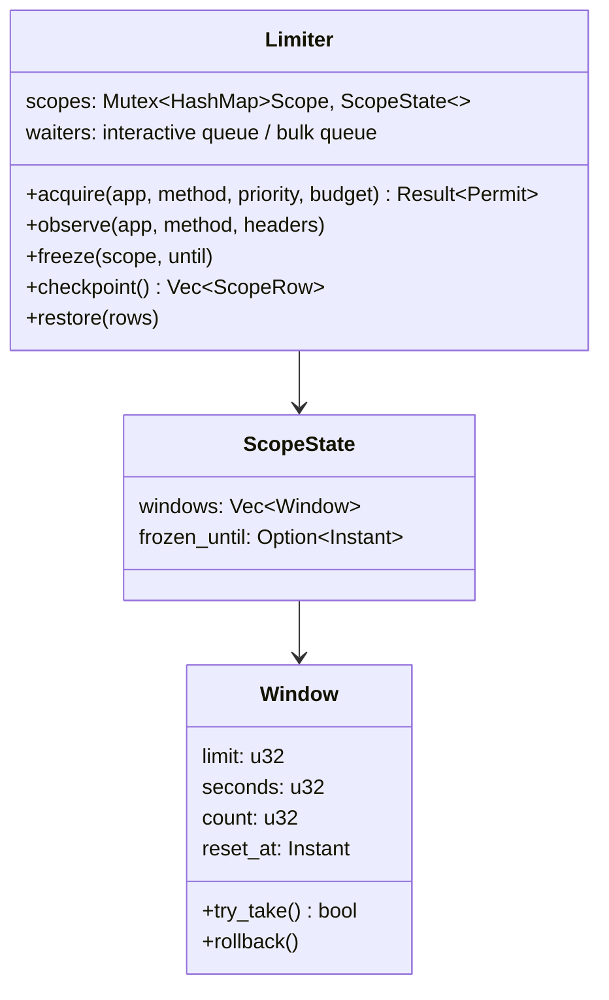
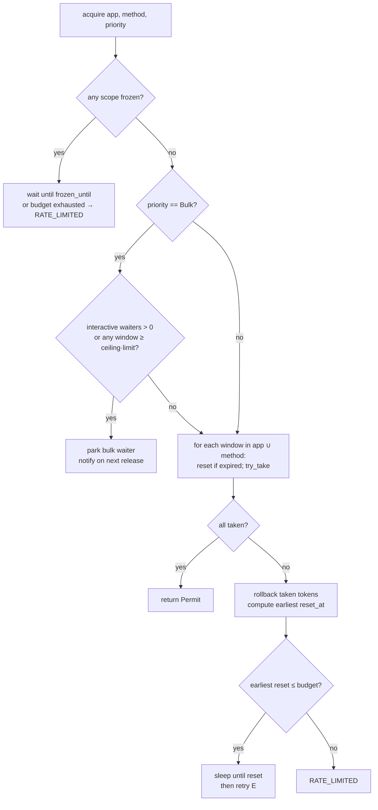

# 05 — Rate limiter

The algorithm is v1's (`src/riot/limiter.ts` + `limiter-scripts.ts`). What changes is that it runs in process memory under a mutex instead of as a Redis Lua script, which removes a network hop from the hot path and ~300 lines of orchestration.

## Scopes and windows

Riot limits on three axes; the proxy tracks two and reacts to the third:

| Scope | Key | Source of limits |
|---|---|---|
| Application | `app:{platform-or-region host}` | `X-App-Rate-Limit` / `-Count` |
| Method | `method:{host}:{endpoint_id}` | `X-Method-Rate-Limit` / `-Count` |
| Service | (not tracked) | untyped 429 → backoff only |

Each scope holds one or more windows, e.g. app `20:1,100:120` → `[{limit:20, seconds:1}, {limit:100, seconds:120}]`.



## Acquire

Identical ordering to v1 §9.2, now one critical section:



`Permit` is a plain struct with no `Drop` side-effects: a token, once taken, is spent whether or not the request succeeds. This matches v1 and Riot's accounting.

`budget` is `CLIENT_WAIT_BUDGET_MS` (2 s) for interactive and effectively unbounded for bulk (bulk waits, it never fails; the scheduler's concurrency cap bounds how many are waiting).

The mutex is held only for the check-and-take, never across the sleep. Contention is negligible: thousands of acquires per second are a few microseconds each.

## Observe

After every upstream response:

1. Parse `X-App-Rate-Limit` and `X-Method-Rate-Limit`; if the window set differs from what we hold, **reconfigure** (new limits, keep counts where windows match by `seconds`).
2. Parse the `-Count` headers and **sync**: `window.count = max(window.count, riot_count)`. Never lower — our count may include in-flight requests Riot has not seen yet.
3. On `429`:
   - `X-Rate-Limit-Type: application|method` + `Retry-After` → `freeze(scope, now + retry_after)`; log at `error` (our accounting was wrong).
   - No type header → service limit: don't touch buckets; the caller (client.rs) backs off `250ms × 2^attempt ± 25 %` up to 3 attempts.

## Priorities and fairness

Two `Notify`-based queues. On every token release (window reset), wake all interactive waiters first; bulk waiters only if the interactive queue is empty **and** no window is above `BULK_USAGE_CEILING` (0.80). Bulk can therefore starve indefinitely during a burst of user traffic — that is the intended guarantee, and a scheduler gauge (`limiter_bulk_waiters`) shows it.

## Persistence across restarts

The one thing Redis actually did for the limiter was survive a process restart. v2 does this with a checkpoint:

- Every 10 s and on `SIGTERM`, `checkpoint()` writes each scope's windows (`count`, `reset_at` as unix ms) and `frozen_until` to `limiter_state`.
- On boot, `restore()` loads them. Windows whose `reset_at` has passed are cleared; the rest keep their counts.
- **Conservative default:** if a checkpoint is older than the longest window (120 s), assume every window is **full** until its reset — worst case the first 2 minutes are slower, never a 429.

The first upstream response's `-Count` headers correct any drift. This is strictly safer than v1, which trusted Redis AOF `everysec` and would over-commit by up to a second of traffic on a hard crash.

## Reference implementation sketch

```rust
pub struct Limiter {
    inner: Mutex<HashMap<Scope, ScopeState>>,
    interactive: Notify,
    bulk: Notify,
    interactive_waiting: AtomicUsize,
    ceiling: f32,
}

impl Limiter {
    pub async fn acquire(&self, app: Scope, method: Scope, prio: Priority, budget: Duration)
        -> Result<Permit, RateLimited>
    {
        let deadline = Instant::now() + budget;
        loop {
            let outcome = {
                let mut g = self.inner.lock();
                if prio == Priority::Bulk
                    && (self.interactive_waiting.load(Relaxed) > 0 || g.over_ceiling(&[&app, &method], self.ceiling))
                {
                    Outcome::ParkBulk
                } else {
                    g.try_take_all(&[&app, &method]) // rolls back on partial failure
                }
            };
            match outcome {
                Outcome::Taken => return Ok(Permit),
                Outcome::Frozen(until) | Outcome::Wait(until) => {
                    if prio == Priority::Interactive && until > deadline { return Err(RateLimited { retry_at: until }); }
                    self.wait_with_priority(prio, until).await;
                }
                Outcome::ParkBulk => self.bulk.notified().await,
            }
        }
    }
}
```

~150 lines with `observe`, `freeze`, `checkpoint`, `restore`. Unit-testable with `tokio::time::pause()` — no Redis in CI.

## As built (P2) — deviations from the above

The sections above are the original design. Where they differ, the implementation in `src/riot/limiter/` and these decisions win:

| Topic | Design above | As built | ADR |
|---|---|---|---|
| Window algorithm | Fixed window: `count`, `reset_at`, reset on expiry | **Sliding log**: admission instants per window, as v1 (#17). No rolling interval ever holds more than `limit`, boundaries included | ADR-023 |
| Riot count sync | `count = max(count, riot_count)` | Pad with entries stamped at sync time up to Riot's count. Never lowers, never moves our own stamps | ADR-023, ADR-024 |
| Freeze trigger | `application\|method` + `Retry-After` | Any typed 429 with a numeric `Retry-After`, `service` included (v1). Error log only for application/method | ADR-024 |
| Service-429 backoff | client.rs, 250 ms × 2ⁿ ± 25 %, 3 tries | Fetcher (P3-05), **v1's** 500 ms × 2ⁿ capped at 8 s, ± 20 %, 3 tries. The client never retries | ADR-017, ADR-021 |
| Interactive over budget | Implied wait | Fail at once with `RATE_LIMITED` and the exact `retry_at` when the wait cannot fit the budget (v1 waited the whole budget) | ADR-025 |
| Bulk ceiling | Any window ≥ ceiling · limit | Same, strictly: bulk needs `used < ceiling × limit` in every app and method window (8/10 at 0.80 blocks) | ADR-025 |
| Waiter tracking | `interactive_waiting` counter | Per-scope count via a drop guard, so a cancelled acquire never leaves a phantom waiter. Gauges `limiter_interactive_waiters`, `limiter_bulk_waiters` | ADR-025 |
| Checkpoint format | `[{limit, seconds, count, reset_at}]` | `{known?, windows:[{limit, seconds, stamps:[[unix_ms, n]…]}]}`. Stamps bucketed to `max(100 ms, seconds ms)` and rounded **up**, so restore is never less conservative | ADR-026 |
| Stale checkpoint | "full until its reset" | Rows older than 120 s restore every window full, stamped at boot (closed for one window length) | ADR-026 |

Verified by: the ported v1 suite (`src/riot/limiter/tests.rs`), a 1 000-case property test (`proptest.rs`, which fails on a planted off-by-one), a kill-and-restart test on a real SQLite file (`tests/limiter_restart.rs`), and a 60 s, 50-task soak (`tests/limiter_soak.rs`, ignored by default).

## Go equivalent

Same structure: `sync.Mutex` around `map[Scope]*ScopeState`, two `sync.Cond` (or channel-based) queues, `time.AfterFunc` for wakeups. Nothing here depends on Rust.
