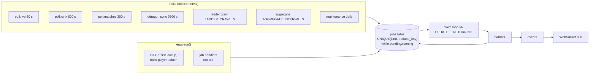
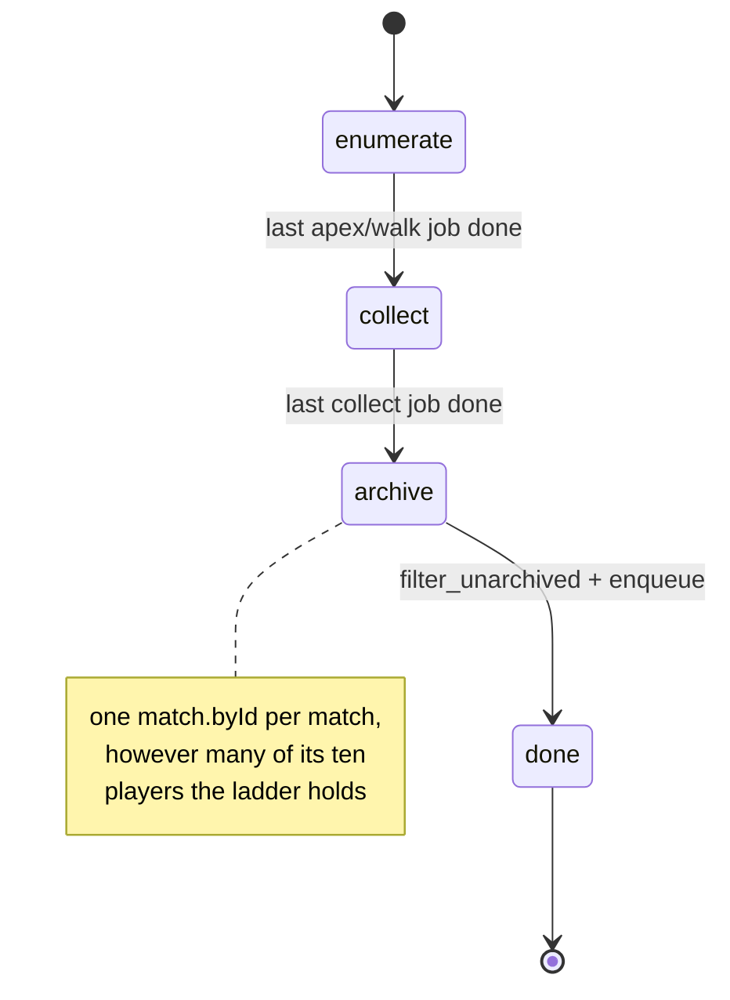
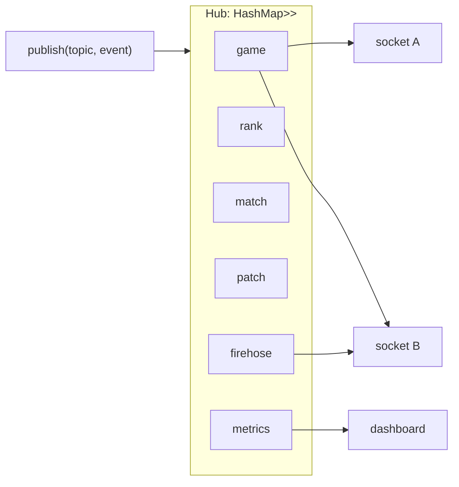

# 06 — Jobs & realtime

## Scheduler

BullMQ is replaced by three small pieces:

1. **Ticks** — repeating timers that *enqueue* work (`poll:live` every 60 s, `ddragon:sync` hourly, …). Implemented as `tokio::time::interval` loops; nothing to persist because a missed tick just fires on next boot.
2. **A durable `jobs` table** — the queue. Every enqueued job is a row; the row is the truth.
3. **A claim loop** — `N` worker tasks (default 8, `JOB_CONCURRENCY`) that claim the highest-priority ready row, run its handler, mark it done or reschedule with backoff.



### Claiming

SQLite's single-writer rule makes this atomic without `SELECT … FOR UPDATE SKIP LOCKED`:

```sql
UPDATE jobs
   SET state = 'running', claimed_at = ?now, attempts = attempts + 1
 WHERE id = (
   SELECT id FROM jobs
    WHERE state = 'pending' AND run_after <= ?now
    ORDER BY priority ASC, run_after ASC
    LIMIT 1)
RETURNING *;
```

The Postgres variant appends `FOR UPDATE SKIP LOCKED` to the subquery; that is the one engine-specific statement in the codebase.

To avoid polling the table at high frequency, `enqueue()` also `notify_one()`s the claim loop; idle workers sleep on the `Notify` with a 1 s fallback timeout.

### Priority

`priority` is an integer, lower first. Reserved bands:

| Band | Kinds | Notes |
|---|---|---|
| 0–99 | interactive-triggered: `archive:match` for a just-finished game, `?refresh=true` | |
| 100–9 999 | `archive:match` ordered by depth in a player's history, in blocks of ten (v1 #31) | `priority = 100 + depth_block` — global, not per player, so anyone's newest ten beat anyone's hundredth |
| 10 000 | polls | |
| 20 000 | `backfill:player`, `ladder:*` | |
| 30 000 | `aggregate:analytics`, `facts:reextract`, `maintenance` | |

Every enqueue sets a priority explicitly; there is no "unprioritised outranks prioritised" surprise because there is no separate `wait` list.

### Dedupe and idempotency

`UNIQUE(kind, dedupe_key) WHERE state IN ('pending','running')` — enqueueing `archive:match` for a match already queued is a no-op `INSERT OR IGNORE`. Once done, the same key may be queued again (a re-archive after `facts_version` bump, say). This replaces v1's "job id ages out" workaround (#18) and the lifecycle-based poll dedupe (#48) with one index.

Handlers are idempotent as in v1: `archive:match` upserts; polls diff against stored state; the crawl stages check `phase`.

### Backoff and failure

`attempts < 5` → `run_after = now + 2^attempts × 30 s ± 20 %`, state back to `pending`. Otherwise `failed` with `error`. `/v1/admin/jobs` lists and retries failed rows; `maintenance` deletes `done` rows older than 7 days.

### Bulk limiter priority

Every handler that hits Riot calls the fetcher with `Priority::Bulk`, so the interactive-first and ceiling guarantees in [05](05-rate-limiter.md) apply automatically. The concurrency cap (`JOB_CONCURRENCY`) bounds how many bulk waiters can be parked.

## Job catalogue (parity with v1)

| Kind | Trigger | Does |
|---|---|---|
| `poll:live` | tick 60 s → one job per tracked player | spectator → `game.started` / `game.ended` |
| `poll:rank` | tick 600 s → per player | league → `rank.changed` |
| `poll:matches` | tick 300 s → per player | page from `last_seen_match_id`, enqueue `archive:match` by depth; gap > `TRACK_CATCHUP_LIMIT` → `backfill:player` |
| `archive:match` | polls, lookups, crawl | fetch, zstd, insert `matches` + `match_facts`, `match.archived` |
| `backfill:player` | first lookup, tracking, admin | page 100 ids at a time up to `LOOKUP_BACKFILL_LIMIT`, enqueue archives |
| `ddragon:sync` | hourly | versions.json → mirror new patch to `data/ddragon`, `patch.new` |
| `ladder:crawl` | tick or admin | create crawl row, fan out `ladder:apex` × 3 + `ladder:walk` × (tier, division) |
| `ladder:apex` / `ladder:walk` | per crawl | upsert `ladder_entries`; last one flips `phase → collect` |
| `ladder:collect` | phase collect | 25 players per job → `crawl_match_ids`; last one flips `phase → archive` |
| `ladder:archive` | phase archive | `filter_unarchived`, enqueue `archive:match`; flips `phase → done`, enqueues `aggregate:analytics` |
| `facts:reextract` | admin / version bump | re-derive `match_facts` in batches of `FACTS_REEXTRACT_BATCH`; no Riot calls |
| `aggregate:analytics` | crawl end, tick, admin | rebuild `champion_*` for the last `AGGREGATE_PATCH_LIMIT` patches |
| `maintenance` | daily | trim `jobs`/`metrics_history`, sweep L2, WAL checkpoint, `VACUUM INTO` backup |

The three-phase crawl is preserved exactly — it is the reason a ten-participant match is fetched once, and it is a design property, not a queue property.



"Last job done" is detected by decrementing a counter on the crawl row inside the same write transaction that marks the job done — no race, because there is one writer.

## Realtime

### Hub



- One `broadcast::Sender` per topic, capacity 256. `firehose` receives every event.
- A socket task holds one `Receiver` per subscribed topic and `select!`s over them plus the inbound frame stream.
- `RecvError::Lagged(n)` → send `{"type":"resync","dropped":n}` and continue, matching v1's slow-consumer behaviour.
- `metrics` ticks only while `sender.receiver_count() > 0` — v1's "costs nothing while nobody watches" rule, now free to check.

### Protocol

Unchanged from v1 §11 so existing consumers keep working:

```jsonc
// client → server
{ "type": "subscribe",   "topics": ["game", "rank"] }
{ "type": "unsubscribe", "topics": ["rank"] }
{ "type": "ping" }
// server → client
{ "type": "event", "topic": "game", "name": "game.started", "at": 1726400000000, "data": { … } }
{ "type": "resync", "dropped": 12 }
{ "type": "pong" }
```

Auth is the same Bearer key on the upgrade request (or `?key=` for browsers, admin topics require admin scope), rate-limited by the consumer quota like any route.

### Events

`events.rs` is an enum with `#[serde(tag = "name")]`, so the set of event names is exhaustively known to the compiler and `utoipa` can document them under the `ws` tag as prose, as v1 does.

| Name | Payload |
|---|---|
| `game.started` / `game.ended` | puuid, platform, gameId, queue, champion |
| `rank.changed` | puuid, queue, before, after |
| `match.archived` | matchId, patch, participants (puuids) |
| `patch.new` | version |
| `crawl.phase` | crawlId, phase, stats |
| `metrics` | the snapshot the dashboard draws |
