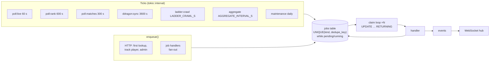
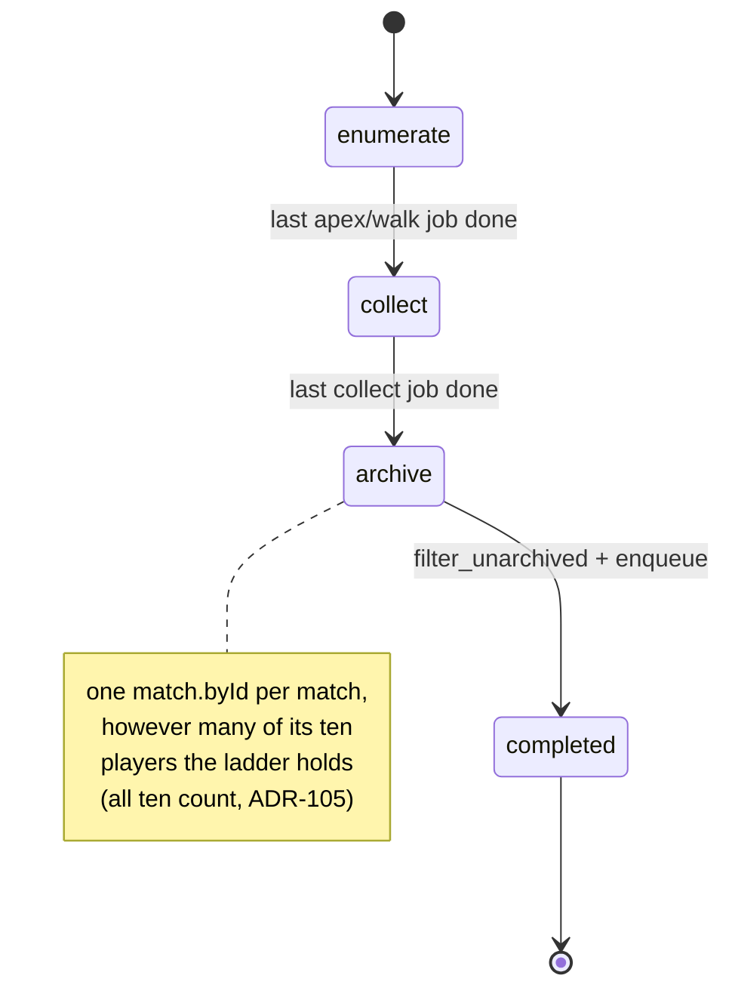
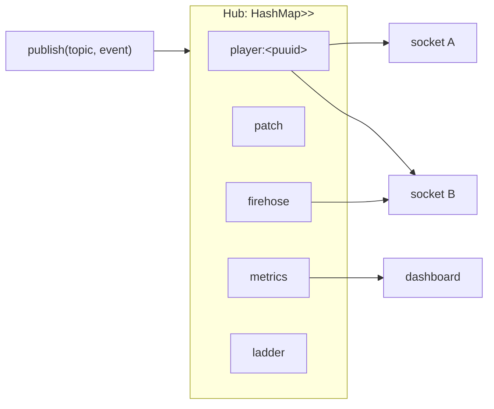

# 06 — Jobs & realtime

## Scheduler

BullMQ is replaced by three small pieces:

1. **Ticks** — repeating timers that *enqueue* work (`poll:live` every 60 s, `ddragon:sync` hourly, …). Implemented as `tokio::time::interval` loops; nothing to persist because a missed tick just fires on next boot.
2. **A durable `jobs` table** — the queue. Every enqueued job is a row; the row is the truth.
3. **A claim loop** — `N` worker tasks (default 8, `JOB_CONCURRENCY`) that claim the highest-priority ready row, run its handler, mark it done or reschedule with backoff.


```mermaid
flowchart LR
    subgraph ticks["Ticks (tokio::interval)"]
        t1[poll:live 60 s]
        t2[poll:rank 600 s]
        t3[poll:matches 300 s]
        t4[ddragon:sync 3600 s]
        t5[ladder:crawl LADDER_CRAWL_S]
        t6[aggregate AGGREGATE_INTERVAL_S]
        t7[maintenance daily]
    end
    subgraph enq["enqueue()"]
        api[HTTP: first lookup,<br/>track player, admin]
        handlers[job handlers<br/>fan-out]
    end
    ticks --> tbl
    enq --> tbl
    tbl[("jobs table<br/>UNIQUE(kind, dedupe_key)<br/>while pending/running")]
    tbl --> claim["claim loop ×N<br/>UPDATE … RETURNING"]
    claim --> run[handler] --> tbl
    run --> ev[events] --> ws[WebSocket hub]
```

### Halting (DEV-22)

`Queue::halt(wait)` holds every worker in this process still: no claims while any `Halt` is alive, every running handler task aborted, then a wait (bounded by `wait`) until each worker is back in its loop. An aborted handler records no outcome, so its row stays `running`. The dev reset (design/10) deletes it. Without a reset, `recover` re-queues it at the next boot. Dropping the `Halt` wakes every worker. Workers count themselves busy before checking the halt and abort a handler that started after one, so a job claimed during the halt never runs to the end. Only the dev reset uses it. Workers in another process (`ROLE=worker`) are not reached.

### Claiming

SQLite's single-writer rule makes the claim atomic without `SELECT … FOR UPDATE SKIP LOCKED`. It is one `UPDATE … RETURNING` (`claim_sql`), and since SCH-01 (ADR-089) it is rate-limit aware:

- **Lanes.** Every job that calls Riot carries a `lane`, the limiter scope its requests hit (`Target::scope()`: the platform for league/spectator, the region for match-v5), and a `method`, the endpoint it mainly calls. Both are derived from the kind and payload at enqueue (`jobs::lanes::of`), so every producer agrees: `ladder:walk` → (platform, `league.entriesByTier`), `ladder:apex` → (platform, the apex league), `ladder:collect` / `backfill:player` / `poll:matches` → (region, `match.idsByPuuid`), `archive:match` → (region of the match id, `match.byId`), `poll:live` → (platform, `spectator.activeGame`), `poll:rank` → (platform, `league.entriesByPuuid`). Kinds that make no Riot call have neither and can always be claimed. Rows queued before V0007 get theirs at boot (`assign_lanes`).
- **Skip blocked work.** Before claiming, the worker asks the limiter what has no bulk room now (`Limiter::bulk_blocked`). A lane is blocked when its *app* limit is: frozen after a typed 429, at `BULK_USAGE_CEILING`, out of tokens, or held for a waiting interactive caller. A method at its ceiling blocks only that `(lane, method)` pair: other endpoints on that lane can still be claimed. The claim excludes both, so a blocked lane's work never holds a worker, and a free lane's lower-band job beats a blocked lane's higher-band one.
- **Bands, then spread.** Among what is claimable, the best priority band wins (0–99, 100–9 999, then each 10 000; see below). Inside it, the lane with the fewest running jobs wins, then `priority, run_after, id` (`CLAIM_ORDER`). So N workers cover N lanes before doubling up on one, and three crawls queued one after another all start at once, along with a finished crawl's `archive:match` downloads in another region.

```sql
UPDATE jobs SET state = 'running', claimed_at = $1, attempts = attempts + 1
 WHERE id = (
   WITH heads(id) AS MATERIALIZED (
     -- each open lane's best ready row, skipping blocked methods
     SELECT (SELECT h.id FROM jobs h
              WHERE h.state = 'pending' AND h.lane = lanes.value AND +h.run_after <= $1
                AND (h.method IS NULL OR h.lane || ' ' || h.method NOT IN (SELECT value FROM json_each($3)))
              ORDER BY priority, run_after, id LIMIT 1)
       FROM json_each($2) AS lanes
     UNION ALL
     -- and the best row with no lane
     SELECT (SELECT h.id FROM jobs h WHERE h.state = 'pending' AND h.lane IS NULL AND +h.run_after <= $1
              ORDER BY priority, run_after, id LIMIT 1))
   SELECT j.id FROM heads JOIN jobs j ON j.id = heads.id
    ORDER BY band(j.priority),
             (SELECT count(*) FROM jobs r WHERE r.state = 'running' AND r.lane IS j.lane),
             j.priority, j.run_after, j.id
    LIMIT 1)
RETURNING *;
```

`$2` is every lane (each platform and region) less the blocked ones, and `$3` the blocked `"lane method"` pairs. One index seek per lane (`jobs_lane_claim`) keeps the claim at about 0.1 ms on a 75 000-row queue, where sorting every ready row took about 60 ms on the single writer. `+run_after` keeps SQLite on that index without `ANALYZE` statistics. The Postgres variant appends `FOR UPDATE SKIP LOCKED` to the subquery; its `json_each` reads are settled with the rest of the stub (P8-04).

**Yield instead of waiting.** A job's fetch (`FetchOptions::JOB`) waits at most `JOB_YIELD_BUDGET_MS` (default 1 000) for the limiter, for the app limit or one method's. If it would wait longer, the fetch fails with `limited_until`, and the handler returns `JobError::Yield { retry_at }`. The scheduler puts the row back to `pending` with `run_after = retry_at`, gives the attempt back, keeps the last real error, and counts nothing in `jobs_total`. A 429 that Riot actually sent is still a failure with backoff. Handlers resume where they stopped: a walk from its page cursor, `ladder:collect` re-queued with only the players it has not done (the yield's `payload` replaces the job's), `backfill:player` from `backfill_state`, `archive:match` from the archive (the match is announced before its timeline is fetched, so a timeline yield loses nothing). The other kinds are one request.

**Take turns.** A walk re-queues itself every `CANCEL_CHECK_PAGES` (10) pages, so higher-priority work queued behind it gets a worker. This takes the place of a per-kind concurrency cap.

**Wake.** `enqueue()` also `notify_one()`s the claim loop. A worker that found nothing claimable sleeps until the next delayed row is due or the first blocked lane or method frees up, whichever is sooner (`idle_for`), or 1 s when there is neither. Single process only (`ROLE=all`, the only role SQLite allows), where the limiter and the workers share memory.

### Priority

`priority` is an integer, lower first. Reserved bands:

| Band | Kinds | Notes |
|---|---|---|
| 0–99 | interactive-triggered: `archive:match` for a just-finished game, `?refresh=true`, a manual analytics recompute, the other half of a match or timeline the archive just stored (TL-01) | the recompute moves a rebuild already queued for its ladder up to 0 (DEV-18); so does the archive, for a match a walk queued |
| 100–9 999 | `archive:match` ordered by depth in a player's history, in blocks of ten (v1 #31) | `priority = 100 + depth_block` — global, not per player, so anyone's newest ten beat anyone's hundredth |
| 10 000 | polls | |
| 20 000 | `backfill:player`, `ladder:*` | |
| 30 000 | `aggregate:analytics`, `facts:reextract`, `builds:extract`, `tiers:backfill`, `maintenance` | |

Every enqueue sets a priority explicitly; there is no "unprioritised outranks prioritised" surprise because there is no separate `wait` list.

### Dedupe and idempotency

`UNIQUE(kind, dedupe_key) WHERE state IN ('pending','running')` — enqueueing `archive:match` for a match already queued is a no-op `INSERT OR IGNORE`. Once done, the same key may be queued again (a re-archive after `facts_version` bump, say). This replaces v1's "job id ages out" workaround (#18) and the lifecycle-based poll dedupe (#48) with one index.

Handlers are idempotent as in v1: `archive:match` upserts; polls diff against stored state; the crawl stages check `phase`.

### Backoff and failure

`attempts < 5` → `run_after = now + 2^attempts × 30 s ± 20 %`, state back to `pending`. A yield to the rate limiter (§Claiming) is not a failure and uses no attempt. Otherwise `failed` with `error`. `/v1/admin/jobs` lists and retries failed rows; `maintenance` deletes `done` rows older than 7 days.

### Activity views

Two admin reads show the queue as the workers see it (DEV-13, ADR-087). Both list ready jobs in `CLAIM_ORDER` (`priority, run_after, id`), the order inside a lane. Across lanes a claim also skips work the limiter has no room for and spreads workers (§Claiming), so "up next" is the order of the work, not exactly which job the next worker takes.

- `GET /v1/admin/jobs/queue?limit=` — the running jobs (oldest claim first), the next `limit` ready jobs (1–100, default 15), how many are ready and how many are waiting out a backoff, and when the soonest delayed job comes due.
- `GET /v1/admin/ladder/crawls/{id}` — one crawl's progress. For each stage (`enumerate` in legs, `collect` in 25-player batches, `archive` in ids handed to the archive queue) it gives `done`/`total`, a state (`done`, `now`, `waiting`, or `stopped`/`skipped` for a crawl that ended early), and a pace and ETA over the last ten minutes. It also lists the legs in flight (with each walk's next page), the crawl's running, next and failed jobs, and how many ready jobs of any kind a worker will claim before the crawl's next one. Last, the platform's crawl-found match downloads. Once handed off, an `archive:match` names only its match, so those counts cover every crawl on the platform.

On `/dashboard` the Ladder tab shows each running crawl as a card: stage bars and a totals line, with the rest of its view in a closed details fold (DEV-17, ADR-091). Past crawls are listed below, finished runs only, ten at a time. Each row opens into that crawl's view. The job queue is a folded panel. Its running and up-next lists (the next 100 ready jobs) put alike jobs, same kind and platform, on one row with their count, in the order each first appears; a collect row gives the player range its batches cover (DEV-20, ADR-093). While the tab is visible, running crawls and open rows refresh every 5 s. A finished crawl is fetched once.

The tab's folded Analytics recompute panel has a **Recompute now** button. It picks a platform and queue from `GET /v1/admin/ladder/options`, as the crawl form does, and calls `POST /v1/admin/analytics/recompute`. The button only queues the job. A recompute asked for this way (the button or the route) is queued at priority 0, ahead of every queued job, and a rebuild already queued for the ladder (a crawl's end, the tick) is moved up to 0 rather than queued twice. The next free worker runs it; no running job is interrupted. It rebuilds from the matches archived so far and makes no Riot call, so it does not wait for a crawl's downloads. The run then appears in the panel's table. The crawl-end and tick rebuilds stay at maintenance priority (DEV-18, ADR-090).

### Live activity

What a running job is doing is kept in memory by the process that runs the workers (DEV-19, ADR-092), in `jobs::activity`. It is not stored.

- **Traces.** A worker that claims a job opens a trace (worker, attempt, start). While the handler runs, the job is its task's *current job* (a tokio task-local), so code anywhere below it can report without being passed anything: `activity::step` (a handler's progress, e.g. `GOLD II page 12 on na1` or `player 7 of 25`), `activity::event` (logged only) and `activity::now` (the "now" line only, for what is momentary). Outside a job all three do nothing. The fetcher reports each call: one line per fetch with its `X-Cache` outcome or error code and how long it took, a rate-limit wait of 20 ms or more, and each failed Riot answer, 429 backoff or 5xx retry. The single-flight upstream leg runs on its own task and inherits the caller's job. The trace closes with the outcome (`done`, `retry later: …`, `failed: …`, `yielded: …` when SCH-01 gives the worker back, or `aborted` at shutdown).
- **Bounds.** At most 200 events per trace (older ones are dropped and counted) and the 200 most recent finished traces. A new attempt replaces the old trace.
- **Reads.** `GET /v1/admin/jobs/activity?limit=` lists every worker with its job and latest step, and the jobs that finished in this process. `GET /v1/admin/jobs/{id}/activity?after=` returns the job's row and its trace from event `after` on (`nextSeq` is the cursor). It 404s only when there is neither a row nor a trace.
- **Scope.** Single process. A `ROLE=api` process has no workers, so it shows none. A cross-process view is a later task, like SCH-01's limiter coordination.

`/dev/jobs` (design/10 §Jobs page) is the page over these reads.

### Bulk limiter priority

Every handler that hits Riot calls the fetcher with `FetchOptions::JOB` (`Priority::Bulk`), so the interactive-first and ceiling guarantees in [05](05-rate-limiter.md) apply automatically. A job waits at most `JOB_YIELD_BUDGET_MS` for a token and then yields its worker (§Claiming), so `JOB_CONCURRENCY` bounds how many jobs run, not how many sit parked in `acquire`.

## Job catalogue (parity with v1)

| Kind | Trigger | Does |
|---|---|---|
| `poll:live` | tick 60 s → one job per tracked player | spectator → `game.started` / `game.ended` |
| `poll:rank` | tick 600 s → per player | league → `rank.changed` |
| `poll:matches` | tick 300 s → per player | page from `last_seen_match_id`, enqueue `archive:match` by depth; gap > `TRACK_CATCHUP_LIMIT` → `backfill:player` |
| `archive:match` | polls, lookups, crawl; the archive, for a stored match's timeline or a stored timeline's match (priority 0), and the boot catch-up (100) (TL-01) | fetch, zstd, insert `matches` + `match_facts`, `match.archived`, then the timeline unless `fetchTimeline` (or `ARCHIVE_TIMELINES`) is false |
| `backfill:player` | first lookup, tracking, admin | page 100 ids at a time up to `LOOKUP_BACKFILL_LIMIT`, enqueue archives |
| `ddragon:sync` | hourly | versions.json → mirror new patch to `data/ddragon`, `patch.new` |
| `ladder:crawl` | tick or admin | create crawl row, fan out `ladder:apex` × 3 + `ladder:walk` × (tier, division) |
| `ladder:apex` / `ladder:walk` | per crawl | upsert `ladder_entries`; an apex league of `RIOT_APEX_LIST_CAP` or more entries adds its tier to the crawl's `apex_capped`; last one flips `phase → collect` |
| `ladder:collect` | phase collect | 25 players per job → `crawl_match_ids`; last one flips `phase → archive` |
| `ladder:archive` | phase archive | `filter_unarchived`, enqueue `archive:match`; ends the crawl `completed`, enqueues `aggregate:analytics`, `ranks:lookup` and `names:backfill` |
| `ranks:lookup` | crawl completed | plan up to `RANK_LOOKUP_LIMIT` archived players the ladder doesn't hold and nobody looked up within `RANK_LOOKUP_RECHECK_S`, most games first, then one `league.entriesByPuuid` each, 25 a turn; an empty list enqueues `aggregate:analytics` (ADR-111) |
| `names:backfill` | crawl end, daily, admin | Riot IDs for nameless players from their latest archived matches; no Riot calls (v1, ADR-055) |
| `facts:reextract` | admin / boot when stale | re-derive facts, bans and `remake` for matches below `FACTS_VERSION`, in batches of `FACTS_REEXTRACT_BATCH`; no Riot calls |
| `builds:extract` | run inline by `aggregate:analytics` | derive `match_builds` from every archived timeline whose match has facts and no rows at `BUILDS_VERSION`, 25 timelines a batch, with the newest mirrored `item.json` and each player's champion from `match_facts` (BLD-05); does nothing without one; no Riot calls (ADR-117, ADR-131) |
| `tiers:backfill` | boot when a ranked match has facts and no tier stamps; run inline by `aggregate:analytics` | stamp `match_tiers` for those matches, 500 a batch, from the ladder and league lookups as they are now (ADR-105's tier), in id order; no Riot calls (ADR-127) |
| `aggregate:analytics` | crawl end, tick, admin | run `builds:extract` and `tiers:backfill`, then rebuild the analytics tables (v1's shape, ADR-056) for the last `AGGREGATE_PATCH_LIMIT` patches; `analytics.updated` |
| `maintenance` | daily | trim `jobs`/`metrics_history`, sweep L2, `PRAGMA optimize`, WAL checkpoint, `VACUUM INTO` backup |

The three-phase crawl is preserved exactly — it is the reason a ten-participant match is fetched once, and it is a design property, not a queue property.


```mermaid
stateDiagram-v2
    [*] --> enumerate
    enumerate --> collect: last apex/walk job done
    collect --> archive: last collect job done
    archive --> completed: filter_unarchived + enqueue
    completed --> [*]
    note right of archive
        one match.byId per match,
        however many of its ten
        players the ladder holds
        (all ten count, ADR-105)
    end note
```

"Last job done" is detected with `crawl_legs`: one row per outstanding job, which the job deletes as it ends. Whoever deletes the last row moves the crawl on in the same write transaction, so there is no race (one writer), and a job re-run after a crash finds no row and changes nothing — which a bare counter would decrement twice (ADR-054). A crawl whose legs include one that gave up ends `failed` rather than moving on; `cancelled` stops it where it stands.

**Riot's apex cap (LAD-01, ADR-097).** An apex league comes back whole, but never longer than `RIOT_APEX_LIST_CAP` (10,000) entries. That number is observed, not documented. On 2026-10-09, with the production key, `masterleagues` for RANKED_SOLO_5x5 listed exactly 10,000 players on kr, euw1 and na1, where dpm.lol counted about 30K, 22K and 12K. The list's lowest LP was 313 on kr, 412 on euw1 and 31 on na1, so the missing players are the bottom of Master. league-exp-v4 pages the same 10,000 (48 pages of 205, then 160), and `league.entriesByTier` refuses MASTER with a 400. When an apex leg stores a list at least that long, the same write transaction adds the tier to `ladder_crawls.apex_capped`, a JSON list in `APEX_TIERS` order (NULL for none). A tier stays marked once set. The crawl routes and the stats snapshot carry it as `apexCapped` (`[]` for none). The dashboard's crawl card shows `Master: top 10,000 only (Riot API limit)` next to the player count, and the showcase ladder shows the same note under a list that long (design 11). The `/dev` Ladder probe (LAD-03, design 10) re-checks the cap against Riot. LAD-02 is meant to find the players the cap leaves out.

## Realtime

### Hub


```mermaid
flowchart LR
    pub["publish(topic, event)"] --> hub
    subgraph hub["Hub: HashMap<Topic, broadcast::Sender<Arc<Event>>>"]
        t1["player:&lt;puuid&gt;"]
        t4[patch]
        t5[metrics]
        t6[firehose]
        t7[ladder]
    end
    t1 --> s1[socket A]
    t1 --> s2[socket B]
    t6 --> s2
    t5 --> s3[dashboard]
```

- One `broadcast::Sender` per topic, capacity 256, created on first subscribe and dropped when its last subscriber leaves. `firehose` receives every event.
- A socket task holds one `Receiver` per subscribed topic and `select!`s over them plus the inbound frame stream.
- `RecvError::Lagged(n)` → send `{"op":"resync","topic":…,"dropped":n}` and continue. v1 had no signal for this: a slow socket either buffered without bound or lost events without being told.
- `metrics` ticks only while `sender.receiver_count() > 0` — v1's "costs nothing while nobody watches" rule, now free to check.

### Protocol

v1's wire protocol (§11), which the embedded dashboard and existing clients speak, plus four additions the owner approved (ADR-045): a `resync` frame, topic validation, closing sockets whose key is revoked, and `op:"event"` on event frames.

```jsonc
// client → server
{ "op": "subscribe",   "topics": ["player:<puuid>", "patch"] }
{ "op": "unsubscribe", "topics": ["patch"] }
{ "op": "ping" }
// server → client
{ "op": "ready", "consumer": "web" }
{ "op": "subscribed", "topics": ["player:<puuid>"] }     // everything the socket now holds
{ "op": "event", "event": "game.started", "topic": "player:<puuid>", "at": 1726400000000, "data": { … } }
{ "op": "resync", "topic": "player:<puuid>", "dropped": 12 }
{ "op": "pong", "at": 1726400000000 }
{ "op": "error", "error": { "code": "FORBIDDEN", "message": "Topic 'metrics' requires the admin scope" } }
```

Topics are v1's: `player:<puuid>` (anything about one player), `patch`, and the admin-only `metrics`, `firehose` and `ladder`. Any other topic is refused with an error frame. A socket holds at most 200 topics. The server pings every 30 s and drops a socket after two unanswered pings. Order is kept within a topic, and so on the firehose, but not across topics.

Auth is the same Bearer key on the upgrade request, or `?token=` for browsers (v1); admin topics require the admin scope and the admin IP allowlist. A revoked key's sockets are closed with 4401, and shutdown closes them with 1001.

### Events

`events.rs` is an enum tagged `event` (the key v1's frames use), so the set of event names is exhaustively known to the compiler and `utoipa` can document them under the `ws` tag as prose, as v1 does. Names and payload fields are v1's, plus `crawl.phase` (ADR-045).

| Name | Topic | Payload |
|---|---|---|
| `game.started` | `player:<puuid>` | puuid, platform, gameId, queueId, championId |
| `game.ended` | `player:<puuid>` | puuid, platform, gameId, queueId, championId |
| `rank.changed` | `player:<puuid>` | puuid, queue, before, after (`{tier, rank, lp}` or null) |
| `match.archived` | `player:<puuid>` | puuid, matchId, patch, participants (puuids) |
| `patch.new` | `patch` | version |
| `crawl.phase` | `ladder` | crawlId, platform, queue, phase, stats |
| `ladder.crawl.completed` | `ladder` | crawlId, platform, queue, entries, players, durationS |
| `analytics.updated` | `ladder` | platform, queue, durationS, tables |
| `metrics.snapshot` | `metrics` | the snapshot the dashboard draws |
