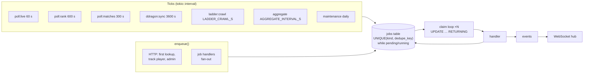
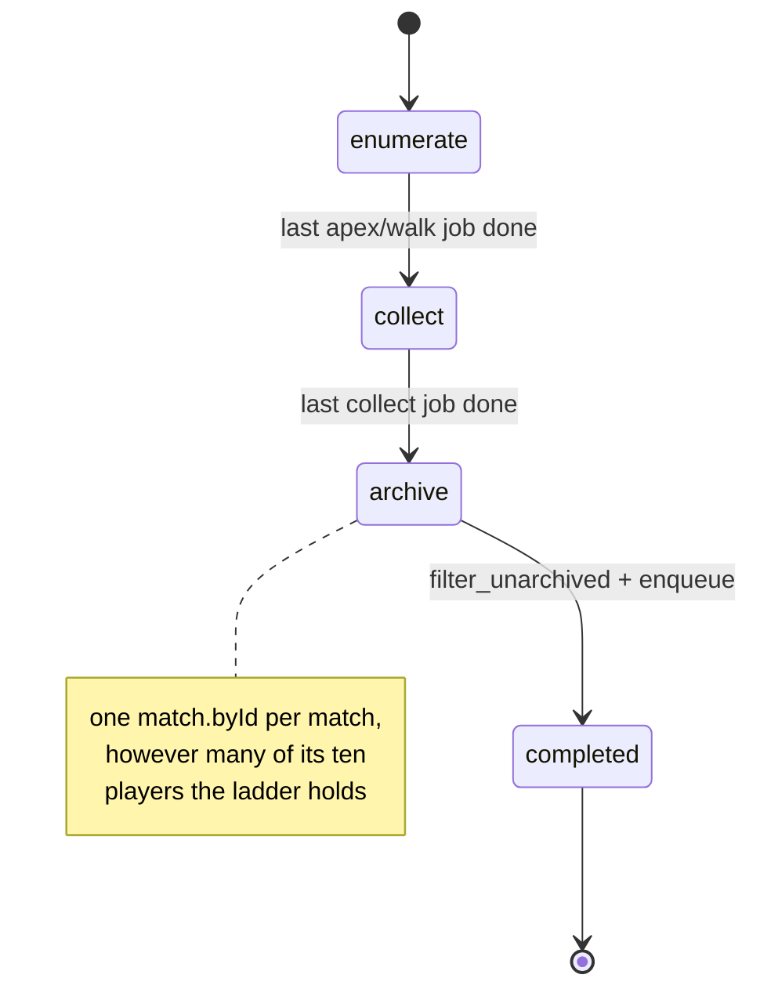
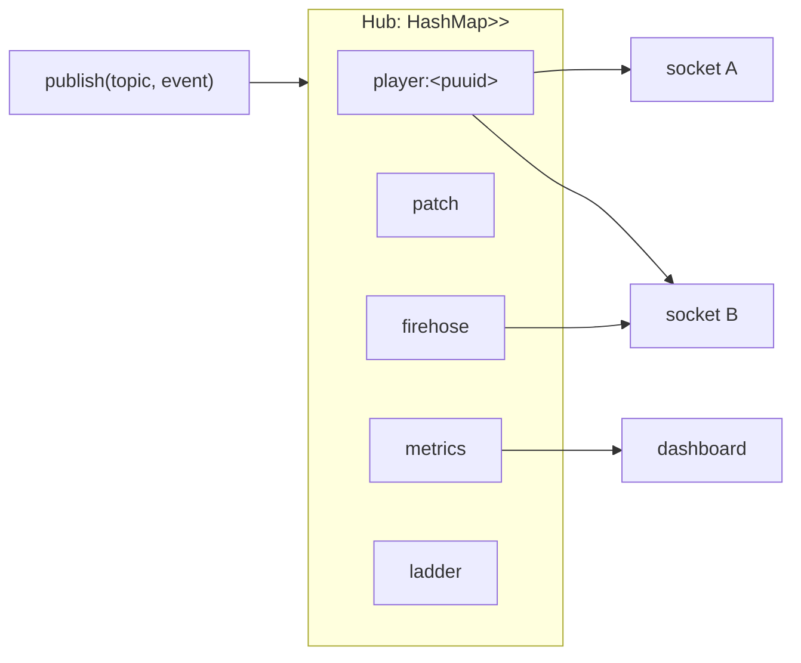

# 06 — Jobs & realtime

## Scheduler

BullMQ is replaced by three small pieces:

1. **Ticks** — repeating timers that *enqueue* work (`poll:live` every 60 s, `ddragon:sync` hourly, …). Implemented as `tokio::time::interval` loops; nothing to persist because a missed tick just fires on next boot.
2. **A durable `jobs` table** — the queue. Every enqueued job is a row; the row is the truth.
3. **A claim loop** — `N` worker tasks (default 8, `JOB_CONCURRENCY`) that claim the highest-priority ready row, run its handler, mark it done or reschedule with backoff.


```mermaid
flowchart LR
    subgraph ticks["Ticks (tokio::interval)"]
        t1[poll:live 60 s]
        t2[poll:rank 600 s]
        t3[poll:matches 300 s]
        t4[ddragon:sync 3600 s]
        t5[ladder:crawl LADDER_CRAWL_S]
        t6[aggregate AGGREGATE_INTERVAL_S]
        t7[maintenance daily]
    end
    subgraph enq["enqueue()"]
        api[HTTP: first lookup,<br/>track player, admin]
        handlers[job handlers<br/>fan-out]
    end
    ticks --> tbl
    enq --> tbl
    tbl[("jobs table<br/>UNIQUE(kind, dedupe_key)<br/>while pending/running")]
    tbl --> claim["claim loop ×N<br/>UPDATE … RETURNING"]
    claim --> run[handler] --> tbl
    run --> ev[events] --> ws[WebSocket hub]
```

### Claiming

SQLite's single-writer rule makes this atomic without `SELECT … FOR UPDATE SKIP LOCKED`:

```sql
UPDATE jobs
   SET state = 'running', claimed_at = ?now, attempts = attempts + 1
 WHERE id = (
   SELECT id FROM jobs
    WHERE state = 'pending' AND run_after <= ?now
    ORDER BY priority ASC, run_after ASC
    LIMIT 1)
RETURNING *;
```

The Postgres variant appends `FOR UPDATE SKIP LOCKED` to the subquery; that is the one engine-specific statement in the codebase.

To avoid polling the table at high frequency, `enqueue()` also `notify_one()`s the claim loop; idle workers sleep on the `Notify` with a 1 s fallback timeout.

### Priority

`priority` is an integer, lower first. Reserved bands:

| Band | Kinds | Notes |
|---|---|---|
| 0–99 | interactive-triggered: `archive:match` for a just-finished game, `?refresh=true`, a manual analytics recompute | the recompute moves a rebuild already queued for its ladder up to 0 (DEV-18) |
| 100–9 999 | `archive:match` ordered by depth in a player's history, in blocks of ten (v1 #31) | `priority = 100 + depth_block` — global, not per player, so anyone's newest ten beat anyone's hundredth |
| 10 000 | polls | |
| 20 000 | `backfill:player`, `ladder:*` | |
| 30 000 | `aggregate:analytics`, `facts:reextract`, `maintenance` | |

Every enqueue sets a priority explicitly; there is no "unprioritised outranks prioritised" surprise because there is no separate `wait` list.

### Dedupe and idempotency

`UNIQUE(kind, dedupe_key) WHERE state IN ('pending','running')` — enqueueing `archive:match` for a match already queued is a no-op `INSERT OR IGNORE`. Once done, the same key may be queued again (a re-archive after `facts_version` bump, say). This replaces v1's "job id ages out" workaround (#18) and the lifecycle-based poll dedupe (#48) with one index.

Handlers are idempotent as in v1: `archive:match` upserts; polls diff against stored state; the crawl stages check `phase`.

### Backoff and failure

`attempts < 5` → `run_after = now + 2^attempts × 30 s ± 20 %`, state back to `pending`. Otherwise `failed` with `error`. `/v1/admin/jobs` lists and retries failed rows; `maintenance` deletes `done` rows older than 7 days.

### Activity views

Two admin reads show the queue as the workers see it (DEV-13, ADR-087). Both use the same claim order as `claim` (`CLAIM_ORDER`: `priority, run_after, id`), so "up next" is what the workers will actually do next.

- `GET /v1/admin/jobs/queue?limit=` — the running jobs (oldest claim first), the next `limit` ready jobs (1–100, default 15), how many are ready and how many are waiting out a backoff, and when the soonest delayed job comes due.
- `GET /v1/admin/ladder/crawls/{id}` — one crawl's progress. For each stage (`enumerate` in legs, `collect` in 25-player batches, `archive` in ids handed to the archive queue) it gives `done`/`total`, a state (`done`, `now`, `waiting`, or `stopped`/`skipped` for a crawl that ended early), and a pace and ETA over the last ten minutes. It also lists the legs in flight (with each walk's next page), the crawl's running, next and failed jobs, and how many ready jobs of any kind a worker will claim before the crawl's next one. Last, the platform's crawl-found match downloads. Once handed off, an `archive:match` names only its match, so those counts cover every crawl on the platform.

On `/dashboard` the Ladder tab shows each running crawl as a card: stage bars and a totals line, with the rest of its view in a closed details fold (DEV-17, ADR-091). Past crawls are listed below, finished runs only, ten at a time. Each row opens into that crawl's view. The job queue is a folded panel. While the tab is visible, running crawls and open rows refresh every 5 s. A finished crawl is fetched once.

The tab's folded Analytics recompute panel has a **Recompute now** button. It picks a platform and queue from `GET /v1/admin/ladder/options`, as the crawl form does, and calls `POST /v1/admin/analytics/recompute`. The button only queues the job. A recompute asked for this way (the button or the route) is queued at priority 0, ahead of every queued job, and a rebuild already queued for the ladder (a crawl's end, the tick) is moved up to 0 rather than queued twice. The next free worker runs it; no running job is interrupted. It rebuilds from the matches archived so far and makes no Riot call, so it does not wait for a crawl's downloads. The run then appears in the panel's table. The crawl-end and tick rebuilds stay at maintenance priority (DEV-18, ADR-090).

### Bulk limiter priority

Every handler that hits Riot calls the fetcher with `Priority::Bulk`, so the interactive-first and ceiling guarantees in [05](05-rate-limiter.md) apply automatically. The concurrency cap (`JOB_CONCURRENCY`) bounds how many bulk waiters can be parked.

## Job catalogue (parity with v1)

| Kind | Trigger | Does |
|---|---|---|
| `poll:live` | tick 60 s → one job per tracked player | spectator → `game.started` / `game.ended` |
| `poll:rank` | tick 600 s → per player | league → `rank.changed` |
| `poll:matches` | tick 300 s → per player | page from `last_seen_match_id`, enqueue `archive:match` by depth; gap > `TRACK_CATCHUP_LIMIT` → `backfill:player` |
| `archive:match` | polls, lookups, crawl | fetch, zstd, insert `matches` + `match_facts`, `match.archived` |
| `backfill:player` | first lookup, tracking, admin | page 100 ids at a time up to `LOOKUP_BACKFILL_LIMIT`, enqueue archives |
| `ddragon:sync` | hourly | versions.json → mirror new patch to `data/ddragon`, `patch.new` |
| `ladder:crawl` | tick or admin | create crawl row, fan out `ladder:apex` × 3 + `ladder:walk` × (tier, division) |
| `ladder:apex` / `ladder:walk` | per crawl | upsert `ladder_entries`; last one flips `phase → collect` |
| `ladder:collect` | phase collect | 25 players per job → `crawl_match_ids`; last one flips `phase → archive` |
| `ladder:archive` | phase archive | `filter_unarchived`, enqueue `archive:match`; ends the crawl `completed`, enqueues `aggregate:analytics` and `names:backfill` |
| `names:backfill` | crawl end, daily, admin | Riot IDs for nameless players from their latest archived matches; no Riot calls (v1, ADR-055) |
| `facts:reextract` | admin / boot when stale | re-derive facts, bans and `remake` for matches below `FACTS_VERSION`, in batches of `FACTS_REEXTRACT_BATCH`; no Riot calls |
| `aggregate:analytics` | crawl end, tick, admin | rebuild the analytics tables (v1's shape, ADR-056) for the last `AGGREGATE_PATCH_LIMIT` patches; `analytics.updated` |
| `maintenance` | daily | trim `jobs`/`metrics_history`, sweep L2, WAL checkpoint, `VACUUM INTO` backup |

The three-phase crawl is preserved exactly — it is the reason a ten-participant match is fetched once, and it is a design property, not a queue property.


```mermaid
stateDiagram-v2
    [*] --> enumerate
    enumerate --> collect: last apex/walk job done
    collect --> archive: last collect job done
    archive --> completed: filter_unarchived + enqueue
    completed --> [*]
    note right of archive
        one match.byId per match,
        however many of its ten
        players the ladder holds
    end note
```

"Last job done" is detected with `crawl_legs`: one row per outstanding job, which the job deletes as it ends. Whoever deletes the last row moves the crawl on in the same write transaction, so there is no race (one writer), and a job re-run after a crash finds no row and changes nothing — which a bare counter would decrement twice (ADR-054). A crawl whose legs include one that gave up ends `failed` rather than moving on; `cancelled` stops it where it stands.

## Realtime

### Hub


```mermaid
flowchart LR
    pub["publish(topic, event)"] --> hub
    subgraph hub["Hub: HashMap<Topic, broadcast::Sender<Arc<Event>>>"]
        t1["player:&lt;puuid&gt;"]
        t4[patch]
        t5[metrics]
        t6[firehose]
        t7[ladder]
    end
    t1 --> s1[socket A]
    t1 --> s2[socket B]
    t6 --> s2
    t5 --> s3[dashboard]
```

- One `broadcast::Sender` per topic, capacity 256, created on first subscribe and dropped when its last subscriber leaves. `firehose` receives every event.
- A socket task holds one `Receiver` per subscribed topic and `select!`s over them plus the inbound frame stream.
- `RecvError::Lagged(n)` → send `{"op":"resync","topic":…,"dropped":n}` and continue. v1 had no signal for this: a slow socket either buffered without bound or lost events without being told.
- `metrics` ticks only while `sender.receiver_count() > 0` — v1's "costs nothing while nobody watches" rule, now free to check.

### Protocol

v1's wire protocol (§11), which the embedded dashboard and existing clients speak, plus four additions the owner approved (ADR-045): a `resync` frame, topic validation, closing sockets whose key is revoked, and `op:"event"` on event frames.

```jsonc
// client → server
{ "op": "subscribe",   "topics": ["player:<puuid>", "patch"] }
{ "op": "unsubscribe", "topics": ["patch"] }
{ "op": "ping" }
// server → client
{ "op": "ready", "consumer": "web" }
{ "op": "subscribed", "topics": ["player:<puuid>"] }     // everything the socket now holds
{ "op": "event", "event": "game.started", "topic": "player:<puuid>", "at": 1726400000000, "data": { … } }
{ "op": "resync", "topic": "player:<puuid>", "dropped": 12 }
{ "op": "pong", "at": 1726400000000 }
{ "op": "error", "error": { "code": "FORBIDDEN", "message": "Topic 'metrics' requires the admin scope" } }
```

Topics are v1's: `player:<puuid>` (anything about one player), `patch`, and the admin-only `metrics`, `firehose` and `ladder`. Any other topic is refused with an error frame. A socket holds at most 200 topics. The server pings every 30 s and drops a socket after two unanswered pings. Order is kept within a topic, and so on the firehose, but not across topics.

Auth is the same Bearer key on the upgrade request, or `?token=` for browsers (v1); admin topics require the admin scope and the admin IP allowlist. A revoked key's sockets are closed with 4401, and shutdown closes them with 1001.

### Events

`events.rs` is an enum tagged `event` (the key v1's frames use), so the set of event names is exhaustively known to the compiler and `utoipa` can document them under the `ws` tag as prose, as v1 does. Names and payload fields are v1's, plus `crawl.phase` (ADR-045).

| Name | Topic | Payload |
|---|---|---|
| `game.started` | `player:<puuid>` | puuid, platform, gameId, queueId, championId |
| `game.ended` | `player:<puuid>` | puuid, platform, gameId, queueId, championId |
| `rank.changed` | `player:<puuid>` | puuid, queue, before, after (`{tier, rank, lp}` or null) |
| `match.archived` | `player:<puuid>` | puuid, matchId, patch, participants (puuids) |
| `patch.new` | `patch` | version |
| `crawl.phase` | `ladder` | crawlId, platform, queue, phase, stats |
| `ladder.crawl.completed` | `ladder` | crawlId, platform, queue, entries, players, durationS |
| `analytics.updated` | `ladder` | platform, queue, durationS, tables |
| `metrics.snapshot` | `metrics` | the snapshot the dashboard draws |
