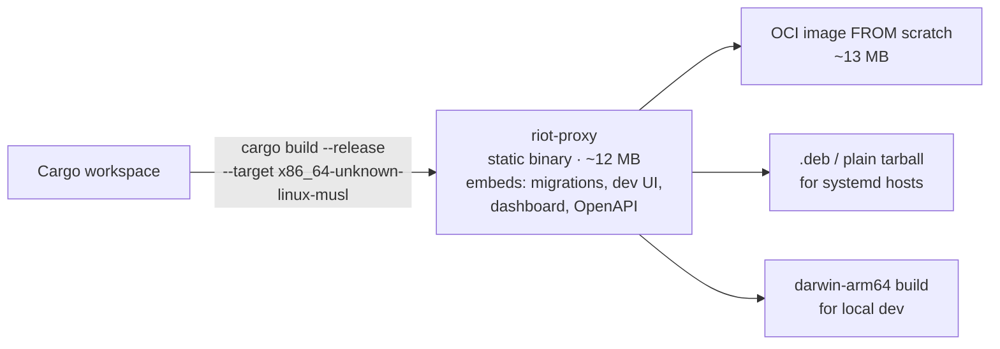
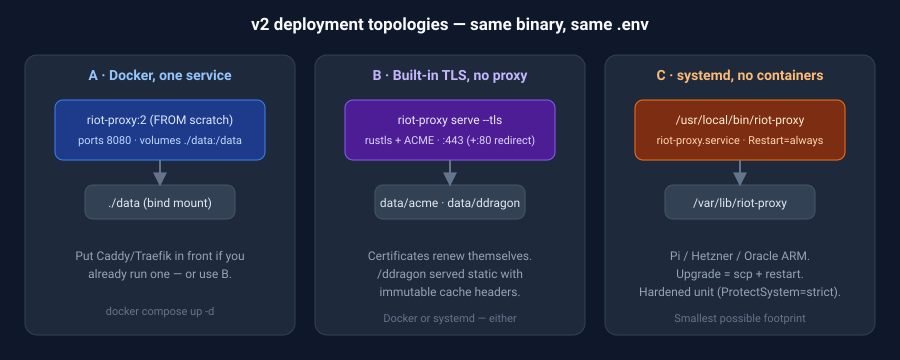

# 07 — Deployment

The deploy story is the point of v2. Every path below is "one artefact, one directory of state".

## The artefact



Everything the service needs at runtime except `.env` and the data directory is inside the binary: `include_str!` for the two HTML pages, `sqlx::migrate!` for schema, `utoipa` for the OpenAPI document, `rustls` + `webpki-roots` so there is not even a CA bundle to mount.

## Option A — Docker, single service

`Dockerfile`:

```dockerfile
# syntax=docker/dockerfile:1
FROM rust:1-alpine AS build
RUN apk add --no-cache musl-dev
WORKDIR /src
COPY Cargo.toml Cargo.lock ./
RUN mkdir src && echo 'fn main(){}' > src/main.rs && cargo build --release && rm -rf src
COPY . .
RUN touch src/main.rs && cargo build --release

FROM scratch
COPY --from=build /src/target/release/riot-proxy /riot-proxy
VOLUME /data
EXPOSE 8080
ENV DATA_DIR=/data
HEALTHCHECK --interval=30s --timeout=3s CMD ["/riot-proxy", "healthcheck"]
ENTRYPOINT ["/riot-proxy"]
CMD ["serve"]
```

(`healthcheck` is a subcommand that GETs `/healthz` — a scratch image has no `curl`.)

`docker-compose.yml` — the whole thing:

```yaml
services:
  riot-proxy:
    image: ghcr.io/ninjagoldfinch/riot-proxy:2
    restart: unless-stopped
    env_file: .env
    ports: ["8080:8080"]
    volumes: ["./data:/data"]
```

That replaces `docker-compose.yml` **and** `docker-compose.prod.yml` from v1. Dev and prod differ only by `.env`.

## Option B — TLS built in (no Caddy)

```bash
riot-proxy serve --tls --domain api.ninjagoldfinch.nz --acme-email ninja@ninjagoldfinch.nz
```

`rustls-acme` obtains and renews a Let's Encrypt certificate into `$DATA_DIR/acme/`, serves 443 and redirects 80. Data Dragon is served from `$DATA_DIR/ddragon` by `tower-http::ServeDir` with `Cache-Control: public, max-age=604800, immutable` — the same headers the v1 Caddyfile set. `/metrics` and `/readyz` are restricted to private ranges by the same middleware that enforces `ADMIN_IP_ALLOWLIST`.

Keep Caddy if you already run it for other services; point it at `:8080` with the v1 `Caddyfile` unchanged.

## Option C — systemd, no containers

```ini
# /etc/systemd/system/riot-proxy.service
[Unit]
Description=riot-proxy
After=network-online.target

[Service]
User=riot-proxy
EnvironmentFile=/etc/riot-proxy/env
ExecStart=/usr/local/bin/riot-proxy serve
WorkingDirectory=/var/lib/riot-proxy
Restart=always
RestartSec=2
# hardening
ProtectSystem=strict
ReadWritePaths=/var/lib/riot-proxy
PrivateTmp=yes
NoNewPrivileges=yes
AmbientCapabilities=CAP_NET_BIND_SERVICE   # only with --tls on 443

[Install]
WantedBy=multi-user.target
```

`scp` the binary, `systemctl restart`. Upgrades are a file copy.

## Option D — PaaS

| Platform | Notes |
|---|---|
| Fly.io | `fly launch` with the scratch image; one `[mounts]` volume for `/data`; `min_machines_running = 1`. Fits the free-ish tier's 256 MB machine with room to spare |
| Railway / Render | Persistent disk at `/data`; single service |
| Hetzner CX22 / Oracle free ARM | Option C. Build `aarch64-unknown-linux-musl` for ARM |
| Raspberry Pi / home server | Same — the whole reason for the small footprint |

Anything with a persistent disk works; anything without one (Cloud Run scale-to-zero, Lambda) does not, because the limiter and archive need local state and Riot's limits are per-key so cold-starting many instances would be actively harmful.

## Configuration

Same variable names as v1 where the concept survives; removed variables are listed so `.env` files can be ported mechanically.

| Variable | Default | Change from v1 |
|---|---|---|
| `RIOT_API_KEY` | — | required |
| `RIOT_USER_AGENT` | `riot-proxy/2.0 (+…)` | |
| `DATA_DIR` | `./data` | **new** — SQLite, ddragon, backups, acme all live here |
| `DATABASE_URL` | `sqlite://$DATA_DIR/riot-proxy.db` | now optional; `postgres://` needs the `postgres` feature |
| `PORT` / `HOST` | `8080` / `0.0.0.0` | |
| `TLS` / `TLS_DOMAIN` / `ACME_EMAIL` | off | **new** |
| `ROLE` | `all` | **new** — `api` / `worker` only with Postgres |
| `JOB_CONCURRENCY` | `8` | **new** |
| `LOG_FORMAT` | `json` (tty → `pretty`) | |
| `ENV` | `development` | replaces `NODE_ENV`; `production` refuses `AUTH_DISABLED`, turns `DEV_UI` off |
| `REDIS_URL` | — | **removed** |
| `SF_LOCK_MS` | — | **removed** (no cross-process single-flight) |
| `DDRAGON_DIR` | `$DATA_DIR/ddragon` | now derived |
| `BOOTSTRAP_ADMIN_KEY` | — | printed on first `serve`, no separate migrate step |
| everything else (`CACHE_TTL_OVERRIDES`, `NEG_TTL_*`, `CLIENT_WAIT_BUDGET_MS`, `BULK_USAGE_CEILING`, `STALE_WHILE_REVALIDATE`, `METRICS_*`, `TRACK_POLL_*`, `LOOKUP_BACKFILL_LIMIT`, `TRACK_CATCHUP_LIMIT`, `LADDER_*`, `FACTS_REEXTRACT_BATCH`, `AGGREGATE_*`, `ADMIN_IP_ALLOWLIST`, `AUTH_DISABLED`, `DEV_UI`, `DOCS_UI`, `DASHBOARD_UI`, `LOG_LEVEL`) | as v1 | unchanged |

## First run

```bash
cp .env.example .env    # set RIOT_API_KEY
./riot-proxy serve
# ── logs ──
# migrated riot-proxy.db (0000_init … 0003_ladder)
# bootstrap admin key (shown once): rpx_…
# listening on http://0.0.0.0:8080  docs=/docs dev=/dev dashboard=/dashboard
```

No Docker, no Redis, no Postgres, no `npm run migrate`. Mint a consumer key with `./riot-proxy key create --name my-website`.

## Sizing

| Deployment | vCPU | RAM | Disk |
|---|---|---|---|
| Tracked players only, no crawl | 1 shared | 256 MB | 1 GB |
| Master+ crawls, one platform | 1 | 512 MB | 5 GB |
| Emerald-floor crawl, timelines on | 2 | 1–2 GB | 50+ GB → consider Postgres |

The binary's own RSS is dominated by the SQLite page cache (`cache_size`, 64 MB default) plus L1 (`moka` weight-bounded, `CACHE_L1_MAX_MB`, default 128). Both are tunable down to run in ~50 MB total on a Pi.

## Backups & restore

- **Automatic:** `maintenance` runs `VACUUM INTO "$DATA_DIR/backups/riot-proxy-<date>.db"` daily, keeps 14. This is a consistent snapshot taken while the service runs.
- **Manual:** `./riot-proxy backup /path/out.db` (same statement) — or `sqlite3 riot-proxy.db ".backup out.db"`.
- **Restore:** stop the service, replace the file, start. There is nothing else to restore; the L1 cache and job heap rebuild themselves and the limiter defaults to conservative on a stale checkpoint.
- **Off-box:** `rclone`/`restic` the `backups/` directory; it is plain files.

## Observability

- `/metrics` — Prometheus, **same metric names as v1** so `ops/grafana/riot-proxy-dashboard.json` and `ops/prometheus-alerts.yml` import unchanged. Add `jobs_pending{kind}`, `limiter_bulk_waiters`, `sqlite_wal_bytes`.
- `/healthz` — process up. `/readyz` — SQLite writable and limiter restored.
- Logs — `tracing` JSON to stdout; every request carries `request_id`, `consumer`, `x_cache`, `upstream_ms`.
- `/dashboard` — same page, same `metrics` + `firehose` topics.

The alerts that matter are unchanged: any 401/403 from Riot, any `application`-typed 429, cache hit ratio < 70 %.

## Upgrade procedure

1. Pull new image / copy new binary.
2. Restart. Migrations apply on boot; the limiter checkpoint is restored; L1 warms from L2.
3. Done. Downtime is the restart time, under a second.

Downgrade: migrations are forward-only. Restore yesterday's backup if a migration is bad — which is why the backup runs *before* the daily maintenance's other steps, and why you should take a manual one before a major upgrade.


