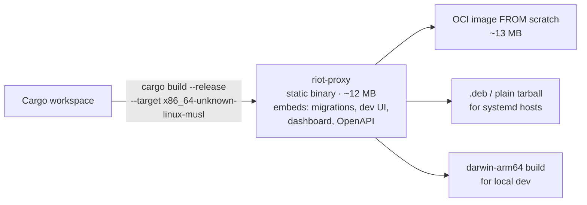
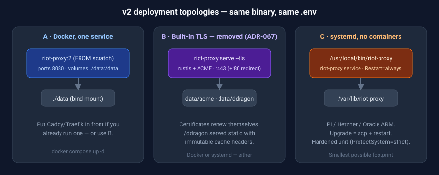

# 07 — Deployment

The deploy story is the point of v2. Every path below is "one artefact, one directory of state".

## The artefact


```mermaid
flowchart LR
    src[Cargo workspace] -->|cargo build --release<br/>--target x86_64-unknown-linux-musl| bin["riot-proxy<br/>static binary · ~12 MB<br/>embeds: migrations, dev UI,<br/>dashboard, OpenAPI"]
    bin --> img["OCI image FROM scratch<br/>~13 MB"]
    bin --> deb[".deb / plain tarball<br/>for systemd hosts"]
    bin --> mac["darwin-arm64 build<br/>for local dev"]
```

Everything the service needs at runtime except `.env` and the data directory is inside the binary: `include_str!` for the two HTML pages, `sqlx::migrate!` for schema, `utoipa` for the OpenAPI document, `rustls` + `webpki-roots` so there is not even a CA bundle to mount.

## Option A — Docker, single service

`Dockerfile`:

```dockerfile
# syntax=docker/dockerfile:1
FROM rust:1-alpine AS build
RUN apk add --no-cache musl-dev
WORKDIR /src
COPY Cargo.toml Cargo.lock ./
RUN mkdir src && echo 'fn main(){}' > src/main.rs && cargo build --release && rm -rf src
COPY . .
RUN touch src/main.rs && cargo build --release

FROM scratch
COPY --from=build /src/target/release/riot-proxy /riot-proxy
VOLUME /data
EXPOSE 8080
ENV DATA_DIR=/data
HEALTHCHECK --interval=30s --timeout=3s CMD ["/riot-proxy", "healthcheck"]
ENTRYPOINT ["/riot-proxy"]
CMD ["serve"]
```

(`healthcheck` is a subcommand that GETs `/healthz` — a scratch image has no `curl`.)

`docker-compose.yml` — the whole thing:

```yaml
services:
  riot-proxy:
    image: ghcr.io/ninjagoldfinch/riot-proxy:2
    restart: unless-stopped
    env_file: .env
    ports: ["8080:8080"]
    volumes: ["./data:/data"]
```

That replaces `docker-compose.yml` **and** `docker-compose.prod.yml` from v1. Dev and prod differ only by `.env`.

## Option B — TLS built in (removed)

Built in P8-03 and removed before 2.0.0 (ADR-067). The proxy is never the public edge: it serves plain HTTP to services on the same host or a private network. Where HTTPS is needed, put Caddy (or nginx) in front of `:8080`; the v1 `Caddyfile` works unchanged.

Data Dragon is served from `$DATA_DIR/ddragon` by `tower-http::ServeDir` with `Cache-Control: public, max-age=31536000, immutable` (a year since SITE-07, ADR-119; the v1 Caddyfile set a week).

Images are mirrored on first request (DEV-05, ADR-076). `GET /ddragon/<version>/img/<kind>/<file>` is served from `$DATA_DIR/ddragon/<version>/img/<kind>/` when the file is there. On a miss it is fetched once from Data Dragon's `/cdn/<version>/img/<kind>/<file>`, written to disk and served.
- `kind` is `champion`, `profileicon`, `item` or `spell`.
- The patch must already be mirrored.
- `file` must be an `image.full` listed in that patch's `champion`, `profileicon`, `item` or `summoner` JSON. Anything else is a bare 404 with no fetch.
- Rune icons (DEV-14, ADR-086) are at `GET /ddragon/<version>/img/perk-images/…`, the path being a style's or rune's `icon` in that patch's `runesReforged` JSON. Data Dragon keeps them unversioned at `/cdn/img/perk-images/…`; the mirror keeps them per patch all the same, at `$DATA_DIR/ddragon/<version>/img/perk-images/…`.
- A Riot 404 is a 404. A non-PNG or failed fetch is a 502, and nothing is kept.

## Option C — systemd, no containers

```ini
# /etc/systemd/system/riot-proxy.service
[Unit]
Description=riot-proxy
After=network-online.target

[Service]
User=riot-proxy
EnvironmentFile=/etc/riot-proxy/env
ExecStart=/usr/local/bin/riot-proxy serve
WorkingDirectory=/var/lib/riot-proxy
Restart=always
RestartSec=2
# hardening
ProtectSystem=strict
ReadWritePaths=/var/lib/riot-proxy
PrivateTmp=yes
NoNewPrivileges=yes

[Install]
WantedBy=multi-user.target
```

`scp` the binary, `systemctl restart`. Upgrades are a file copy.

## Option D — PaaS

| Platform | Notes |
|---|---|
| Fly.io | `fly launch` with the scratch image; one `[mounts]` volume for `/data`; `min_machines_running = 1`. Fits the free-ish tier's 256 MB machine with room to spare |
| Railway / Render | Persistent disk at `/data`; single service |
| Hetzner CX22 / Oracle free ARM | Option C. Build `aarch64-unknown-linux-musl` for ARM |
| Raspberry Pi / home server | Same — the whole reason for the small footprint |

Anything with a persistent disk works; anything without one (Cloud Run scale-to-zero, Lambda) does not, because the limiter and archive need local state and Riot's limits are per-key so cold-starting many instances would be actively harmful.

## Configuration

Same variable names as v1 where the concept survives; removed variables are listed so `.env` files can be ported mechanically.

| Variable | Default | Change from v1 |
|---|---|---|
| `RIOT_API_KEY` | — | required |
| `RIOT_USER_AGENT` | `riot-proxy/2.0 (+…)` | |
| `DATA_DIR` | `./data` | **new** — SQLite, ddragon, backups all live here |
| `DATABASE_URL` | `sqlite://$DATA_DIR/riot-proxy.db` | now optional; `postgres://` needs the `postgres` feature |
| `PORT` / `HOST` | `8080` / `0.0.0.0` | |
| `TRUST_PROXY` | `false` | **new** — v1 always trusted `X-Forwarded-For` (ADR-068) |
| `ROLE` | `all` | **new** — `api` / `worker` only with Postgres |
| `JOB_CONCURRENCY` | `8` | **new** |
| `JOB_YIELD_BUDGET_MS` | `1000` | **new** — how long a job's fetch waits for the rate limiter before the job re-queues itself and frees its worker (SCH-01, ADR-089); `0`–`900000` |
| `LOG_FORMAT` | `json` (tty → `pretty`) | |
| `ENV` | `development` | replaces `NODE_ENV`; `production` refuses `AUTH_DISABLED` and always turns `DEV_UI` off (ADR-071) |
| `REDIS_URL` | — | **removed** |
| `SF_LOCK_MS` | — | **removed** (no cross-process single-flight) |
| `DDRAGON_DIR` | `$DATA_DIR/ddragon` | now derived |
| `ARCHIVE_TIMELINES` | `true` | v1 defaulted to `false`. Archive jobs, ladder crawls included, now fetch each match's timeline unless it is `false` (ADR-098) |
| `RANK_LOOKUP_LIMIT` | `50000` | **new** — players one `ranks:lookup` run looks up, most archived games first; `0` turns the lookups off (ADR-111) |
| `RANK_LOOKUP_RECHECK_S` | `604800` (7 days) | **new** — a player looked up this recently is left off the next run's list (ADR-111) |
| `LOOKUP_BACKFILL_LIMIT` | `4294967295` (`u32::MAX`) | v1 capped it at 10000; now the walk ends where the player's history does (ADR-081) |
| `BOOTSTRAP_ADMIN_KEY` | — | printed on first `serve`, no separate migrate step |
| everything else (`CACHE_TTL_OVERRIDES`, `NEG_TTL_*`, `CLIENT_WAIT_BUDGET_MS`, `BULK_USAGE_CEILING`, `STALE_WHILE_REVALIDATE`, `METRICS_*`, `TRACK_POLL_*`, `TRACK_CATCHUP_LIMIT`, `LADDER_*`, `FACTS_REEXTRACT_BATCH`, `AGGREGATE_*`, `ADMIN_IP_ALLOWLIST`, `AUTH_DISABLED`, `DEV_UI`, `DOCS_UI`, `DASHBOARD_UI`, `LOG_LEVEL`) | as v1 | unchanged |

## First run

```bash
cp .env.example .env    # set RIOT_API_KEY
./riot-proxy serve
# ── logs ──
# migrated riot-proxy.db (0000_init … 0003_ladder)
# bootstrap admin key (shown once): rpx_…
# listening on http://0.0.0.0:8080  docs=/docs dev=/dev dashboard=/dashboard
```

No Docker, no Redis, no Postgres, no `npm run migrate`. Mint a consumer key with `./riot-proxy key create --name my-website`.

## Sizing

| Deployment | vCPU | RAM | Disk |
|---|---|---|---|
| Tracked players only, no crawl | 1 shared | 256 MB | 1 GB |
| Master+ crawls, one platform | 1 | 512 MB | 5 GB |
| Emerald-floor crawl, timelines on | 2 | 1–2 GB | 50+ GB → consider Postgres |

The binary's own RSS is dominated by the SQLite page cache (`cache_size`, 64 MB default) plus L1 (`moka` weight-bounded, `CACHE_L1_MAX_MB`, default 128). Both are tunable down to run in ~50 MB total on a Pi.

## Backups & restore

- **Automatic:** `maintenance` runs `VACUUM INTO "$DATA_DIR/backups/riot-proxy-<date>.db"` daily, keeps 14. This is a consistent snapshot taken while the service runs.
- **Manual:** `./riot-proxy backup /path/out.db` (same statement) — or `sqlite3 riot-proxy.db ".backup out.db"`.
- **Restore:** stop the service, replace the file, start. There is nothing else to restore; the L1 cache and job heap rebuild themselves and the limiter defaults to conservative on a stale checkpoint.
- **Off-box:** `rclone`/`restic` the `backups/` directory; it is plain files.

## Observability

- `/metrics` — Prometheus, **same metric names as v1** so `ops/grafana/riot-proxy-dashboard.json` and `ops/prometheus-alerts.yml` import unchanged. Add `jobs_pending{kind}`, `limiter_bulk_waiters`, `sqlite_wal_bytes`.
- `/healthz` — process up. `/readyz` — SQLite writable and limiter restored; it also reports the SQLite readers, total and idle, without failing on 0 idle (ADR-113).
- Logs — `tracing` JSON to stdout; every request carries `request_id`, `consumer`, `x_cache`, `upstream_ms`.
- `/dashboard` — same page, same `metrics` + `firehose` topics.

The alerts that matter are unchanged: any 401/403 from Riot, any `application`-typed 429, cache hit ratio < 70 %.

## Upgrade procedure

1. Pull new image / copy new binary.
2. Restart. Migrations apply on boot; the limiter checkpoint is restored; L1 warms from L2.
3. Done. Downtime is the restart time, under a second.

Downgrade: migrations are forward-only. Restore yesterday's backup if a migration is bad — which is why the backup runs *before* the daily maintenance's other steps, and why you should take a manual one before a major upgrade.


