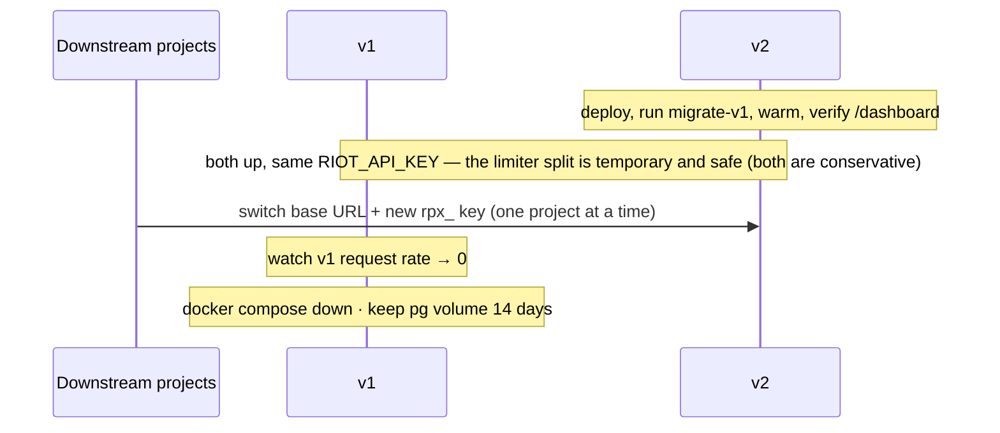
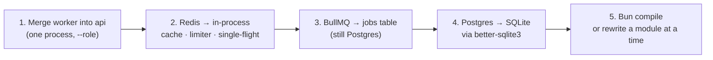

# 08 — Migration plan

Two viable routes. **Option A** is recommended; **Option B** is the fallback if a full rewrite stalls.

## Option A — clean rewrite, contract-first

Build v2 in a new directory (`v2/` in the same repo, or a `riot-proxy` branch that becomes `main`), driven by v1's own OpenAPI document as the acceptance contract.

```mermaid
gantt
    title v2 build order (solo, part-time — sizes are relative)
    dateFormat X
    axisFormat %s

    section Foundations
    P0 config · SQLite · migrations · logging · metrics · CLI     :p0, 0, 2
    section Riot
    P1 client · routing · endpoints · error policy                  :p1, after p0, 2
    P2 limiter + checkpoint (port + unit tests)                     :p2, after p1, 3
    P3 L1/L2 cache · negative · single-flight · SWR · fetcher       :p3, after p2, 2
    section Surface
    P4 auth · quota · /v1/riot /v1/lol · OpenAPI · /docs           :p4, after p3, 3
    P5 archive · facts · /v1/players composites                    :p5, after p4, 2
    section Background
    P6 scheduler · durable jobs · polls · backfill · WS · events   :p6, after p5, 4
    P7 ddragon mirror · ladder crawl · analytics · dashboard       :p7, after p6, 3
    section Ship
    P8 contract tests vs v1 · data migration · TLS · packaging     :p8, after p7, 3
```



### Phase details

| Phase | Done when |
|---|---|
| **P0** | `riot-proxy serve` boots, migrates an empty DB, serves `/healthz` and `/metrics`; `key create` works; CI builds a musl binary |
| **P1** | `riot-proxy riot get account/by-riot-id/europe/Faker/KR1` CLI subcommand returns Riot's bytes; all 9 endpoint groups in `endpoints.rs`; `sea → asia` handled |
| **P2** | Limiter passes a port of v1's `test/limiter*.test.ts` under `tokio::time::pause()`; checkpoint round-trips |
| **P3** | `fetcher` implements the sequence diagram in [03](03-architecture.md#request-lifecycle-read-path); `X-Cache` states all reachable in tests with a mocked upstream (`wiremock`) |
| **P4** | `/openapi.json` from v2 validates every route v1's `openapi.json` lists (diff the operation ids); Scalar at `/docs` |
| **P5** | A match archived by v2 round-trips byte-identical; `/v1/players/{riotId}` composite matches v1's shape |
| **P6** | Tracked player → `game.started` seen on `/v1/ws`; restart mid-backfill resumes from the jobs table |
| **P7** | A `MASTER`-floor crawl completes all three phases; `/dashboard` renders |
| **P8** | The acceptance suite (below) is green against v2; `migrate-v1` imports a v1 dump; image published |

### Contract tests

v1's `acceptance/` suite hits a running instance over HTTP. Port it as-is (keep it in TypeScript with `vitest` if you like — it's a black box) and run it against both v1 and v2. Where they disagree, v1 is right unless the spec says otherwise. That is the whole definition of "feature parity".

Add one thing v1 lacks: a **replay test**. Record ~200 real upstream responses (with `RIOT_API_KEY` redacted) into `test/fixtures/`, serve them from `wiremock`, and assert the exact sequence of limiter acquires and cache states. This is the test that would have caught v1's #17 and #29 before they shipped.

### Data migration

Only the archive is worth carrying over — everything else rebuilds itself.

```bash
# on the v1 box
pg_dump -t matches -t timelines -t players --data-only -Fc riotproxy > v1.dump
# on the v2 box
riot-proxy migrate-v1 --from v1.dump   # streams rows → zstd → SQLite; ~5k matches/s
```

`migrate-v1` re-derives `match_facts` from the imported bodies (so `facts_version` starts clean) and imports `players` with `tracked` and `backfill_state` intact. Consumer keys are **not** migrated: mint new ones and rotate downstream projects — a good moment to do it anyway, and it avoids copying hashes between systems.

If both run on the same key during cut-over, the `key_scope` matches and cached encrypted IDs stay valid.

### Cut-over



## Option B — strangler path

If the rewrite risks never shipping, shrink v1 in place first. Each step is independently mergeable and lands most of the deploy win.



After step 4 the deploy is `node dist/index.js` + one volume: two of the three v2 goals met, in TypeScript. Step 5 is optional. The trade is a heavier artefact and the Node-version treadmill — see [02](02-stack-options.md#d-keep-node-trim-the-stack).

## Risks

| Risk | Mitigation |
|---|---|
| Rust async learning curve stalls P6 (WS + broadcast + select!) | Do P6's hub as the *first* spike, in isolation, before P0 — it's 200 lines and de-risks the scariest part |
| SQLite write contention under a big crawl | One writer thread + batched inserts (500 matches/txn); measured SQLite inserts of 10–15 KB blobs run tens of thousands/s, orders of magnitude above what a Riot key can feed |
| Feature parity drift | Contract suite is the gate; nothing ships until it's green |
| Losing v1's hard-won limiter edge cases | Port its tests before its code |
| Single process = single point of failure | It already was (one Riot key); v2 restarts in < 1 s with persisted state, which is better availability than v1's compose stack |

## What gets deleted

For the satisfaction of it — v1 files that have no v2 counterpart:

`docker-compose.yml`, `docker-compose.prod.yml`, `Caddyfile` (optional), `src/redis.ts`, `src/riot/limiter-scripts.ts`, `src/cache/singleflight.ts` (Redis-locked version), `src/jobs/queues.ts`, `src/db/migrate.ts` (separate step), `drizzle.config.ts`, `.nvmrc`, `.npmrc`, `scripts/reset.sh`, `ops/pg-backup`, and the "Redis persistence matters more than it looks" paragraph in the README.
