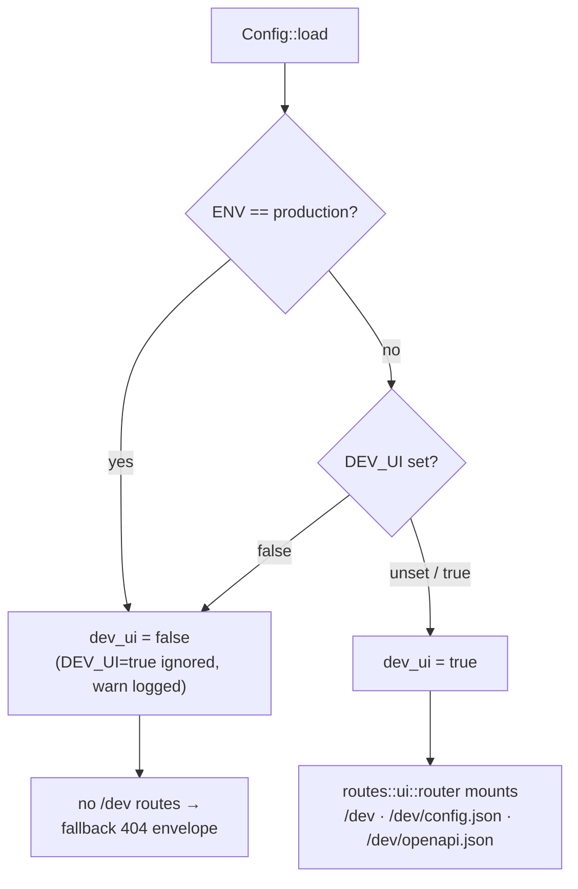
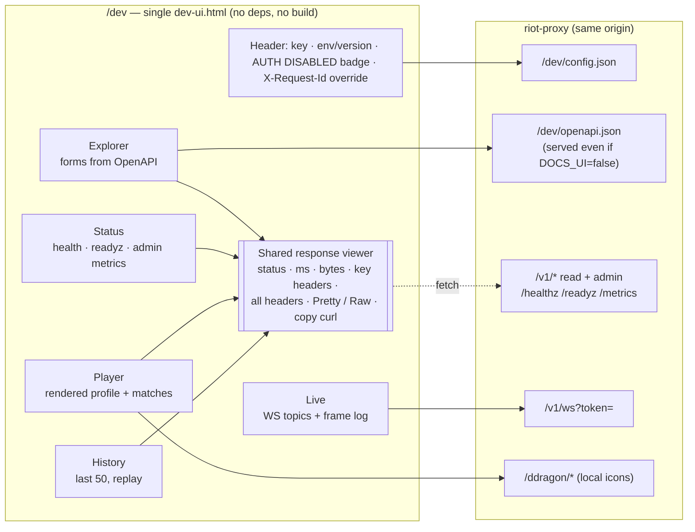
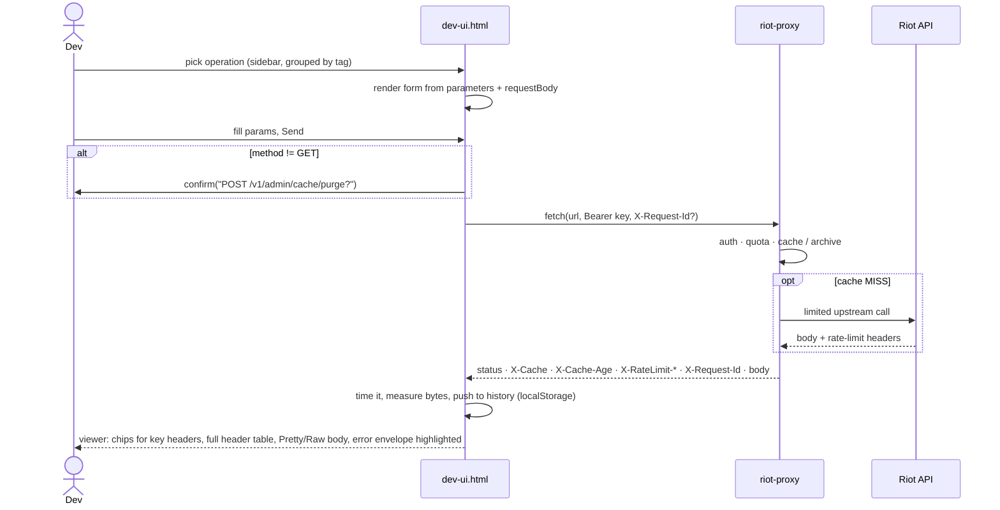

# 10 — Dev explorer (`/dev`)

| | |
|---|---|
| **Status** | Accepted (owner, task DEV-01, ADR-071) |
| **Date** | 2026-10-05 |
| **Replaces** | v1's `public/dev-ui.html` player viewer (P4-06) |

One self-contained page, served only outside production, that exercises every feature the proxy has and shows the raw request and response for each call. It is a troubleshooting tool for whoever runs the proxy, not a product surface.

## Principles

- **The spec is the inventory.** Every API route registers through `utoipa` (`routes/docs.rs::api_router`), so the explorer builds its forms from the OpenAPI document. A new route shows up without UI work.
- **Hand-written HTML only where it adds something:** status, a player view, the live WebSocket log and request history.
- **One file, no build.** It uses inline CSS and JS with no external URLs, and is embedded with `include_str!` like the dashboard.
- **Raw first.** Every rendered card can show the exact response: status, timing, size, headers and body.

## Gating

`/dev*` exists only when the process is not in production. Unlike v1, `DEV_UI=true` cannot turn it on in production, because the explorer can fire admin `POST`/`DELETE` calls.

## What the page talks to

All calls are same-origin; the proxy has no CORS layer. `/dev/openapi.json` is the same document as `/openapi.json`, but it is served even when `DOCS_UI=false`.

## One explorer request

## Page map

| Tab (`#hash`) | Calls | Renders |
|---|---|---|
| `explorer` | any documented operation | form from `parameters` / `requestBody`, then the response viewer |
| `status` | `/healthz`, `/readyz`, `/v1/admin/metrics` | readiness pills, totals, limiter scopes, queues, cache; optional 5 s refresh |
| `player` | `/v1/players/by-riot-id/{gameName}/{tagLine}/profile`, `/v1/players/{puuid}/matches`, `/v1/static/queues`, `/v1/lol/matches/{region}/{matchId}`, `/v1/admin/players/{puuid}/archive`, `/v1/admin/players/{puuid}/archive/matches` | profile card, ranks, top mastery, history and backfill card, recent or archived matches (DEV-02/03, below) |
| `live` | `/v1/ws` | topic picker, newest-first frame log (500 max), ping |
| `history` | — | last 50 requests (`localStorage`, without bodies); re-open or replay |

## Player tab (DEV-02)

- **Recent matches page by 10, 25 or 50**, with Prev/Next. The size is remembered in `localStorage` (`rp.dev.pageSize`). The matches API serves at most 20 per call, so the page makes 1–3 calls (`start`/`count` chunks) and joins them. Next is enabled only when every call came back full.
- **Filters**: queue, offered from Riot's `queues.json` via `/v1/static/queues` minus deprecated and unnamed queues, and `type` (`ranked`, `normal`, `tourney`, `tutorial`, as the API documents). A filter change goes back to page 1.
- **A summary over the page**: games, W/L, win rate, KDA and CS/min. Remakes are left out of the record and the averages.
- **Queue names** come from the same `queues.json`, falling back to `gameMode queueId`.
- **Clicking a match** opens its scoreboard inline: both teams, with the looked-up player marked. It closes with ×, a second click or Esc, and `raw` shows the match body.
- **History and backfill card** (DEV-03), from `GET /v1/admin/players/{puuid}/archive`, with exact counts and no caps:
  - tracked or not, and the history walk's state (walking, queued, complete, stopped part-way, never) and depth;
  - how many matches are archived for the player, with W/L, remakes and timelines, the date range, and a count per queue;
  - the newest seen match;
  - this player's `archive:match` jobs by state (queued, running, done in the last 7 days, failed);
  - the last walk job.

  Buttons: **Browse all N archived**, Track/Untrack, and "Queue walk N deep". The last two are admin calls behind `confirm()`.
- **Source: Riot (live) or Archive (all stored)** (DEV-03). The archive source reads `GET /v1/admin/players/{puuid}/archive/matches`: one call per page (`count` up to 100), newest first, with `total`, so the pager shows "page X of Y", First and Last. It filters by queue only, and makes no Riot calls. Its rows render in the same table and scoreboard as live ones.
- **Every response window has ×**, and Esc closes the newest open thing on the current tab.
- The pure helpers sit in one marked block that `tests/dev_ui.mjs` unit-tests with `node --test`, run from `cargo test`. `tests/dom/` drives the whole page in jsdom against a fake API (`just ui-test`; CI job `test`).

## Safety

- Any non-`GET` asks for `confirm()` first.
- The key lives in `localStorage` (`rp.dev.key`). It is sent only as `Authorization: Bearer`, except for the WebSocket handshake, which requires `?token=`.
- "Copy as curl" writes `$RIOT_PROXY_KEY`, never the key itself.
