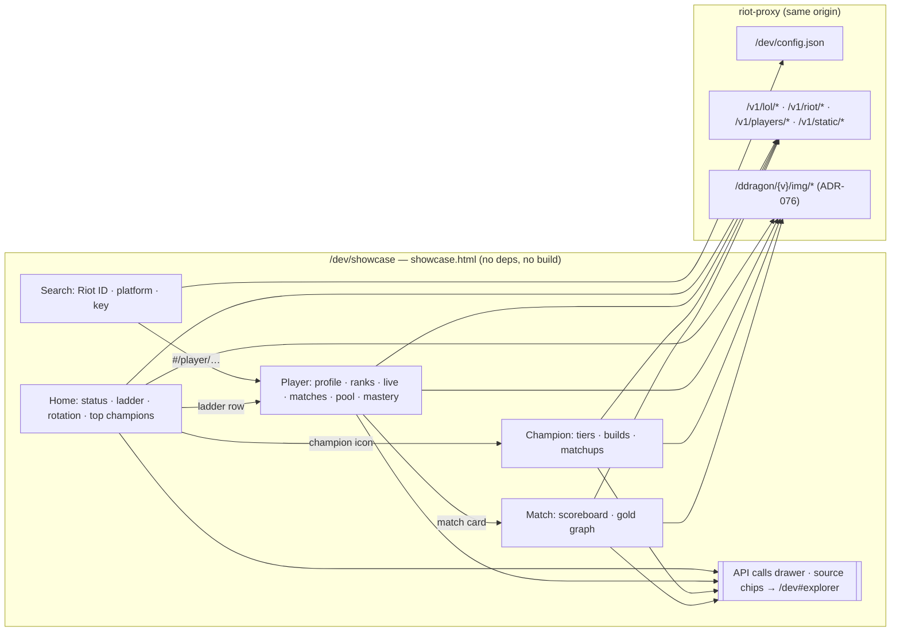

# 11 — Showcase (`/dev/showcase`)

| | |
|---|---|
| **Status** | Accepted (owner, task DEV-06, ADR-080) |
| **Date** | 2026-10-08 |
| **Related** | [10 — Dev explorer](10-dev-explorer.md), ADR-076 (local Data Dragon images) |

An example consumer frontend built only on the proxy's read routes: a ladder, player pages, match history and champion stats, styled like a product rather than a debugging tool. It is a living example. When a read route is added or changes shape, this page changes with it (see [the coverage rule](#the-coverage-rule)).

`/dev` shows raw requests and responses. The showcase shows what a frontend could build from them, and every card names the calls behind it.

## Gating

The same as `/dev` (design/10 §Gating): mounted only when `dev_ui` is on, so never in production, and off with `DEV_UI=false`. The page is served without a key. The API calls it makes need a key with read scope, unless `AUTH_DISABLED`. It shares the explorer's key (`localStorage` `rp.dev.key`) and reads `/dev/config.json` for the platform list.

It is in the page bar (design/10 §Page bar) as **Showcase**, right after Dev explorer and behind the same flag. In production neither link exists.

## Principles

- **One file, no build, no other origin** (`src/ui/showcase.html`, `include_str!`). Icons come from the local mirror at `/ddragon/{v}/img/{kind}/{file}` (ADR-076), never from Riot's CDN.
- **Read routes only.** A consumer frontend has a read key, so the page calls no `/v1/admin/*` route.
- **No platform by default** (ADR-065). The page asks for one and remembers it in `rp.showcase.platform`.
- **Teaching first.** Each card carries chips naming its operations; a chip opens that operation in `/dev#explorer`. The **API calls** drawer at the bottom lists every call the page made, with status, time and `X-Cache`.
- **No invented Riot semantics.** Bodies are read as Riot documents them (league-v4 `LeagueListDTO`, champion-v3 `ChampionInfo`, lol-status-v4 `PlatformDataDto`) or as the proxy's spec does. Rank emblems are not in Data Dragon, so tiers are CSS badges.
- **Every call revalidates** (`fetch(…, {cache: 'no-cache'})`, DEV-24, ADR-099). The analytics routes send `max-age=300`, and without this a recompute stayed hidden behind the browser's copy for up to five minutes. An unchanged analytics read still costs only a 304 through its `ETag`.
- Pure helpers sit in a marked block that `tests/showcase.mjs` unit-tests; `tests/dom/showcase.test.mjs` drives the page in jsdom against a fake API (`tests/dom/fake-api.mjs`).
- **Layout is tested in a real browser** (`tests/dom/showcase.browser.test.mjs`, headless Chromium via `playwright-core`, ADR-084). Every view is checked at 1280, 820 and 390 px against the same fake API, with real PNGs at Data Dragon's sizes. The checks: every icon renders at its class's size (22, 28, 48 px, avatar 64) whatever the image's own size; nothing is wider than its box or the window; compact lines (match-card stats, rank cards, names, numbers, chips) stay on one line; match-card parts don't overlap; table cells stay table cells; the gold tooltip stays inside the chart. Screenshots of each view are a CI artifact.
- **Sizing rules:** a class sets an icon's size and an image only fills that box. Names and chips end in an ellipsis rather than wrap. Queue labels drop Riot's trailing "games". On phones, match cards put the result row on top and drop CS, and scoreboards drop CS, lane and the damage bar.

## Page map

| View (`#hash`) | Task | Calls | Renders |
|---|---|---|---|
| `#/` home | DEV-06 | `/v1/lol/league/apex/{platform}/{tier}/{queue}`, `/v1/riot/accounts/by-puuid/{puuid}` | ladder: Challenger, Grandmaster or Master × Solo/Duo or Flex, highest LP first, 25 a page, names for the visible page only (five calls at a time, cached for the session). A league of 10,000 players or more (`RIOT_APEX_LIST_CAP`, LAD-01) gets the note `Master: top 10,000 only (Riot API limit)` under the list: Riot left out the rest of the tier |
| | | `/v1/lol/status/{platform}` | a banner per maintenance or incident; nothing when there are none |
| | | `/v1/lol/rotations/{platform}`, `/v1/static/champion` | free rotation as champion icons |
| | | `/v1/lol/analytics/patches?queue&platform`, `/v1/lol/analytics/champions?platform&queue&patch&limit=500` | top 10 by win rate and by games, rows summed over tiers, for the ladder's queue. A patch picker (DEV-21) offers **All patches** (the default, `patch=all`) and each patch the ladder has analytics for, with its games; a picked patch the list lacks falls back to all. A patch with too few games says so instead of "no analytics yet" |
| (every view) | DEV-06 | `/v1/static/versions`, `/v1/static/champion` | patch badge; champion names and icon files |
| `#/player/{gameName}/{tagLine}` | DEV-07 | `/v1/players/by-riot-id/{gameName}/{tagLine}/profile?platform&topMastery=3` | header (profile icon, level, top 3 mastery), rank cards from the profile's `league` part (Solo/Duo and Flex always, unranked shown as such; apex tiers without a division), **Refresh** (`refresh=true`, disabled for `refreshAvailableIn`) |
| | | `/v1/players/{puuid}/matches?platform&start&count=10[&queue][&champion]`, `/v1/static/queues`, `/v1/static/summoner`, `/v1/static/runes` | match cards: result (Arena placement, remake, win, loss), queue name, champion with its level on the portrait, KDA, CS/min, gold, damage, spells, keystone over secondary style, and items (the role quest slot, `roleBoundItem`, after the inventory; filled slots first, empty boxes last, DEV-30); **Load more** while `hasMore`; the backfill notice when the lookup queued one. With a champion picked in the pool (SITE-02), a `Name ✕` button clears it, and "Only games archived so far" shows while `archive.complete` is false |
| | | `/v1/players/{puuid}/champions?platform&limit=10[&queue]` | champion pool from the archive; the All / Solo/Duo / Flex tabs filter it and the match history together; clicking a row filters the match history to that champion (`champion=`) |
| | | `/v1/lol/mastery/by-puuid/{platform}/{puuid}` | every mastered champion and the point total, 12 shown until **Show all** (the profile carries only the top few) |
| | | `/v1/lol/spectator/active/{platform}/{puuid}` | live-game banner: queue, time played, both teams' champions; nothing on a 404 (not in a game) |
| `#/match/{region}/{matchId}` | DEV-08 | `/v1/lol/matches/{region}/{matchId}`, `…/timeline` | opened from a match card, on the region its match page named. Header (queue, date, duration, patch); a scoreboard per side (or per Arena subteam, by placement) with totals, bans, objectives, and per player champion with its level on the portrait, spells, keystone over secondary style, Riot ID (links to the player), KDA, CS, damage bar, gold, vision, items (in the match card's order); the player who opened it highlighted |
| | | | gold-difference graph: blue side's `totalGold` minus red side's per timeline frame, sided by the match's `participantId` → `teamId`; one diverging line around 0, blue above and red below (validated for the dark surface), direct labels, a crosshair readout on hover or keyboard focus, and a table view. Only for two sides, 100 and 200; a failed timeline costs only the graph |
| `#/champion/{id}` | DEV-08, DEV-21, DEV-25 | `/v1/lol/analytics/patches?queue[&platform]&championId`, `/v1/lol/analytics/champions/{championId}?queue&patch&limit=10[&platform]`, `/v1/static/runes`, `/v1/static/item` | header with Solo/Duo · Flex tabs (shared with the ladder), a region picker (**All regions** or a platform; it starts on the platform picked above and leaves that one alone) and the patch picker (shared with home, **All patches** by default), which lists the patches this champion was played on with its own games (DEV-25), so a picked patch it lacks falls back to all; rates by tier, highest first and `UNKNOWN` (players no ladder crawl or rank lookup placed, ADR-105) last (games, win rate, pick and ban rate, KDA, CS/min, gold/min) with games and wins summed over tiers; builds: items by name, spell pairs, keystone + secondary style by icon and name |
| | | `/v1/lol/analytics/champions/{championId}/matchups?queue&patch&limit=200[&platform]` | every lane matchup, most games first, with lane tabs (the detail carries only the top few). No platform picked: every platform summed, as the route does |

The ranked-entries route is left out: the profile composite already carries the same league-v4 entries (ADR-082).

An image the mirror cannot serve (an item retired since that game, say) becomes the same empty box, with a champion's initials where it has them. Rune icons come from the mirror too, by their runesReforged.json `icon` path (ADR-086). A champion's level is drawn once, as a badge on the portrait's corner, as the client does.

## The coverage rule

The page holds a JSON block, `<script type="application/json" id="coverage">`, with two maps:

- `showcased`: operation → where the page uses it;
- `notShowcased`: operation → why it is left out (`planned: DEV-0n …`, or a lasting reason such as "pinned-cluster variant").

`tests/ui.rs` reads the OpenAPI document and fails when:

- a `GET` operation tagged `players`, `riot`, `lol` or `static` is in neither map, or in both;
- either map names an operation that is not in the spec, or is not a read route;
- a `notShowcased` entry has no reason;
- a `showcased` operation's path (up to its first parameter) never appears in the page's script.

So a PR that adds a read route fails CI until the showcase uses it or records why not. A PR that changes a read route's response shape updates the page and its tests in the same PR (CLAUDE.md, IMPLEMENTATION §0.1).
