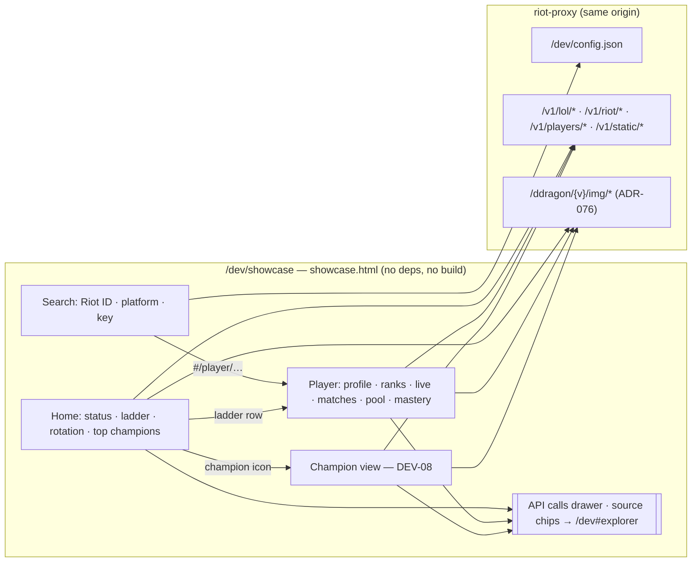

# 11 — Showcase (`/dev/showcase`)

| | |
|---|---|
| **Status** | Accepted (owner, task DEV-06, ADR-080) |
| **Date** | 2026-10-08 |
| **Related** | [10 — Dev explorer](10-dev-explorer.md), ADR-076 (local Data Dragon images) |

An example consumer frontend built only on the proxy's read routes: a ladder, player pages, match history and champion stats, styled like a product rather than a debugging tool. It is a living example. When a read route is added or changes shape, this page changes with it (see [the coverage rule](#the-coverage-rule)).

`/dev` shows raw requests and responses. The showcase shows what a frontend could build from them, and every card names the calls behind it.

## Gating

The same as `/dev` (design/10 §Gating): mounted only when `dev_ui` is on, so never in production, and off with `DEV_UI=false`. The page is served without a key. The API calls it makes need a key with read scope, unless `AUTH_DISABLED`. It shares the explorer's key (`localStorage` `rp.dev.key`) and reads `/dev/config.json` for the platform list.

It is in the page bar (design/10 §Page bar) as **Showcase**, right after Dev explorer and behind the same flag. In production neither link exists.

## Principles

- **One file, no build, no other origin** (`src/ui/showcase.html`, `include_str!`). Icons come from the local mirror at `/ddragon/{v}/img/{kind}/{file}` (ADR-076), never from Riot's CDN.
- **Read routes only.** A consumer frontend has a read key, so the page calls no `/v1/admin/*` route.
- **No platform by default** (ADR-065). The page asks for one and remembers it in `rp.showcase.platform`.
- **Teaching first.** Each card carries chips naming its operations; a chip opens that operation in `/dev#explorer`. The **API calls** drawer at the bottom lists every call the page made, with status, time and `X-Cache`.
- **No invented Riot semantics.** Bodies are read as Riot documents them (league-v4 `LeagueListDTO`, champion-v3 `ChampionInfo`, lol-status-v4 `PlatformDataDto`) or as the proxy's spec does. Rank emblems are not in Data Dragon, so tiers are CSS badges.
- Pure helpers sit in a marked block that `tests/showcase.mjs` unit-tests; `tests/dom/showcase.test.mjs` drives the page in jsdom against a fake API.

## Page map

| View (`#hash`) | Task | Calls | Renders |
|---|---|---|---|
| `#/` home | DEV-06 | `/v1/lol/league/apex/{platform}/{tier}/{queue}`, `/v1/riot/accounts/by-puuid/{puuid}` | ladder: Challenger, Grandmaster or Master × Solo/Duo or Flex, highest LP first, 25 a page, names for the visible page only (five calls at a time, cached for the session) |
| | | `/v1/lol/status/{platform}` | a banner per maintenance or incident; nothing when there are none |
| | | `/v1/lol/rotations/{platform}`, `/v1/static/champion` | free rotation as champion icons |
| | | `/v1/lol/analytics/champions?platform&queue&limit=500` | top 10 by win rate and by games, rows summed over tiers, for the ladder's queue |
| (every view) | DEV-06 | `/v1/static/versions`, `/v1/static/champion` | patch badge; champion names and icon files |
| `#/player/{gameName}/{tagLine}` | DEV-07 | `/v1/players/by-riot-id/{gameName}/{tagLine}/profile?platform&topMastery=3` | header (profile icon, level, top 3 mastery), rank cards from the profile's `league` part (Solo/Duo and Flex always, unranked shown as such; apex tiers without a division), **Refresh** (`refresh=true`, disabled for `refreshAvailableIn`) |
| | | `/v1/players/{puuid}/matches?platform&start&count=10[&queue]`, `/v1/static/queues`, `/v1/static/summoner` | match cards: result (Arena placement, remake, win, loss), queue name, KDA, CS/min, gold, damage, spells and items; **Load more** while `hasMore`; the backfill notice when the lookup queued one |
| | | `/v1/players/{puuid}/champions?platform&limit=10[&queue]` | champion pool from the archive; the All / Solo/Duo / Flex tabs filter it and the match history together |
| | | `/v1/lol/mastery/by-puuid/{platform}/{puuid}` | every mastered champion and the point total, 12 shown until **Show all** (the profile carries only the top few) |
| | | `/v1/lol/spectator/active/{platform}/{puuid}` | live-game banner: queue, time played, both teams' champions; nothing on a 404 (not in a game) |
| `#/champion/{id}` | DEV-08 | analytics champion detail and matchups; match and timeline for match detail | rates by tier, matchups, scoreboard, gold-difference graph |

Until DEV-08 lands, the champion view says so and links to the explorer. The ranked-entries route is left out: the profile composite already carries the same league-v4 entries (ADR-082).

An image the mirror cannot serve (an item retired since that game, say) becomes the same empty box, with a champion's initials where it has them. Rune icons are not mirrored (ADR-076 kinds: champion, profileicon, item, spell), so match cards show no runes.

## The coverage rule

The page holds a JSON block, `<script type="application/json" id="coverage">`, with two maps:

- `showcased`: operation → where the page uses it;
- `notShowcased`: operation → why it is left out (`planned: DEV-0n …`, or a lasting reason such as "pinned-cluster variant").

`tests/ui.rs` reads the OpenAPI document and fails when:

- a `GET` operation tagged `players`, `riot`, `lol` or `static` is in neither map, or in both;
- either map names an operation that is not in the spec, or is not a read route;
- a `notShowcased` entry has no reason;
- a `showcased` operation's path (up to its first parameter) never appears in the page's script.

So a PR that adds a read route fails CI until the showcase uses it or records why not. A PR that changes a read route's response shape updates the page and its tests in the same PR (CLAUDE.md, IMPLEMENTATION §0.1).
