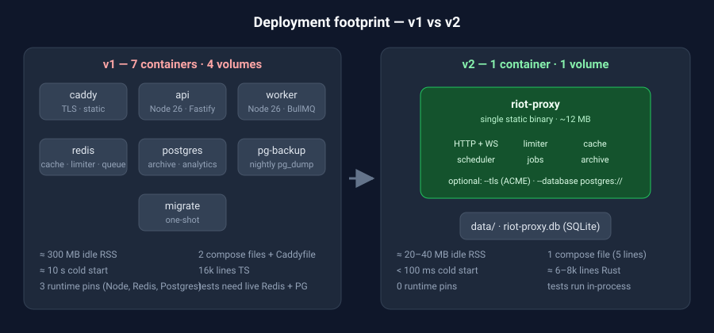

# riot-proxy v2 — Redesign

| | |
|---|---|
| **Status** | Proposal / design draft |
| **Date** | 2026-09-16 |
| **Supersedes** | `docs/riot-proxy-spec.md` (Draft v1.0), where the two disagree |
| **Scope** | League of Legends first; TFT/Valorant remain extensible |

v1 works. It is also **five containers, two databases, a queue broker and ~16k lines of TypeScript** to guard one API key. v2 keeps every guarantee v1 makes — hidden key, aggressive caching, header-driven rate limiting, single-flight, stale-while-revalidate, an immutable match archive, jobs, realtime — and delivers them as **one static binary, one SQLite file, one container**.

## The one-sentence redesign

> A Riot API proxy is bound by a single API key's rate limit, so it never needs more than one process. Once you accept that, Redis, BullMQ, Postgres and the second worker container are all solving a coordination problem you do not have.

Everything else in these docs follows from that observation.

## Headline decisions

| Concern | v1 | v2 |
|---|---|---|
| Language / runtime | TypeScript on Node 26 | **Rust** (axum + tokio) — Go is the documented runner-up |
| Processes | `api` + `worker` + `migrate` | One binary, `--role api\|worker\|all` (default `all`) |
| Cache | Redis | In-process (`moka`) with SQLite write-behind for persistence |
| Rate limiter | Redis Lua script | In-process, `tokio::sync::Mutex` per bucket; state checkpointed to SQLite |
| Archive / relational data | PostgreSQL 18 | **SQLite (WAL)**; Postgres behind a feature flag for archives past ~50 GB |
| Job queue | BullMQ on Redis | In-process scheduler + SQLite-backed durable job table |
| Realtime fan-out | Redis pub/sub → WS | `tokio::sync::broadcast` → WS |
| TLS / static | Caddy container | Caddy **or** the binary's own `--tls` (rustls + ACME) |
| Deploy artefact | 5 images, 4 volumes | 1 image (~15 MB), 1 volume |
| Cold start | ~10 s (Node + migrate + healthchecks) | < 100 ms |
| Idle RSS | ~300–400 MB across services | ~20–40 MB |

## Non-goals (unchanged from v1)

- Multi-tenant SaaS for other developers
- Full mirror of every Riot endpoint
- Tournament API / RSO OAuth
- Horizontal scaling of the proxy itself (see [03-architecture](03-architecture.md#why-one-process-is-not-a-compromise))

## Document map

| # | Doc | What it answers |
|---|---|---|
| 01 | [Current state](01-current-state.md) | What v1 is, what it costs, what it gets right |
| 02 | [Stack options](02-stack-options.md) | Rust vs Go vs Bun vs "just trim Node" — scored, with a recommendation |
| 03 | [Architecture](03-architecture.md) | Components, request lifecycle, process model, diagrams |
| 04 | [Data & cache](04-data-and-cache.md) | SQLite schema, cache tiers, `key_scope`, persistence |
| 05 | [Rate limiter](05-rate-limiter.md) | In-process header-driven buckets, priorities, 429 policy |
| 06 | [Jobs & realtime](06-jobs-and-realtime.md) | Scheduler, durable jobs, crawl phases, WebSocket topics |
| 07 | [Deployment](07-deployment.md) | Docker, systemd, Fly/Railway/Hetzner; sizing; backups |
| 08 | [Migration plan](08-migration-plan.md) | Phased build order, v1 → v2 data migration, cut-over |
| 09 | [Resources](09-resources.md) | Crates, docs, reference projects |
| — | [img/](img/) | Standalone SVG diagrams used above |

All diagrams are Mermaid (rendered natively by GitHub) except the two in `img/`, which are plain SVG so they work in any viewer.

